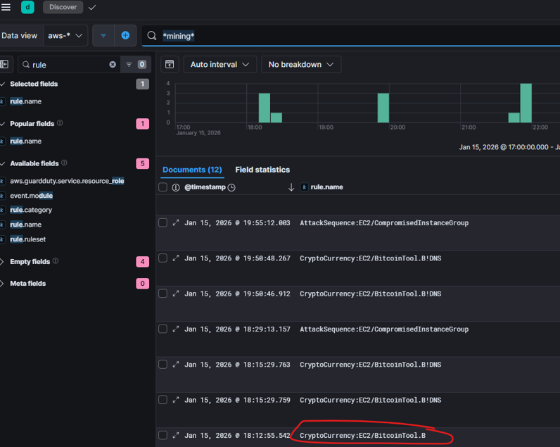

# AWS

## AWS01
> GuardDuty detected cryptocurrency mining activity. What is the name of the first rule that identified this activity?

In the Security->Alerts dashboard we did not find any alert related to cryptocurrency mining activity. We then went to Discovery dashboard, opened `aws-*` dataview and search for `*mining*` add field `rule.name` to table:

> Flag: `CryptoCurrency:EC2/BitcoinTool.B`

## AWS02
>

> Flag: ``

## AWS03
>

> Flag: ``

## AWS04
>

> Flag: ``

## AWS05
>

> Flag: ``

## AWS06
>

> Flag: ``

## AWS07
>

> Flag: ``

## AWS08
>

> Flag: ``

## AWS09
>

> Flag: ``

## AWS10
>

> Flag: ``

## AWS11
>

> Flag: ``

## AWS12
>

> Flag: ``