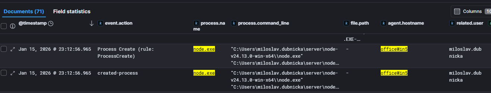
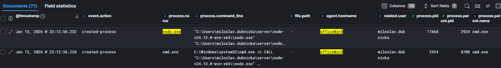
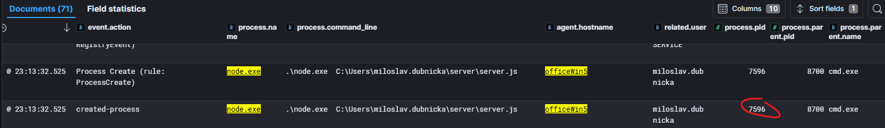
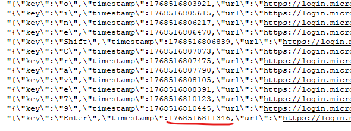
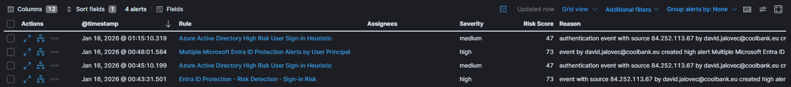
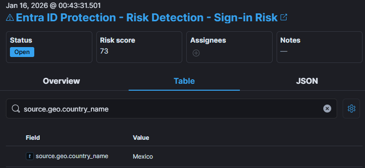
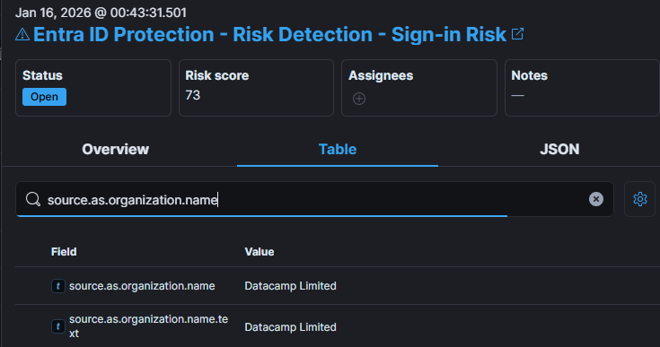
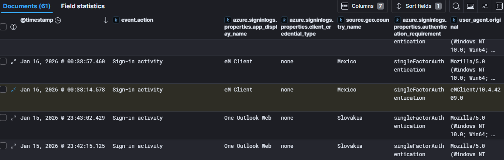
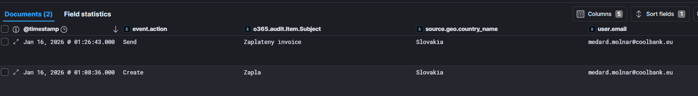
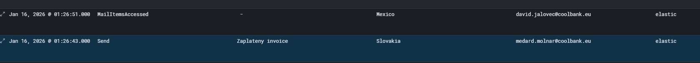

# EXT

## EXT01
> Analysts in your organization noticed another user's suspicious logon from foreign country. After initial analysis you realize that the leak may be much worse than it seems. While analyzing emails you notice conversation about new browser extension that users started installing. What is email of the user who notified colleagues of new extension?

The first step was to show emails in Kibana Discover dashboard, in `o365-*` Data view and show subjects. After looking through them we found emails with `Našiel som skvelé rozšírenie na zvýrazňovanie textu` which sounded suspicious. We also added fields `event.action` and `o365.audit.UserId` to better understand action and who performed it.


> Flag: `miroslav.jakabovic@coolbank.eu`

## EXT02
> You take a closer look at the emails and write down some things you have noticed as they might be important down the road. What is the subject of email chain in which employees discuss this extension?

Visible in previous task.

> Flag: `Našiel som skvelé rozšírenie na zvýrazňovanie textu`

## EXT03
> When was the first email regarding extension sent? 
Use ISO8601 format e.g.: 2026-01-17T22:49:53

Since there were multiple timestamps in the event, we consulted LLM to see if field `o365.audit.CreationTime` was the time when email was sent. Note that `@timestamp` shown in the screenshot is in CET timezone which is UTC+1.

> Flag: `2026-01-15T21:56:26`

## EXT04
> What are the emails of users that replied in conversation with Miroslav Jakabovic about extension?
Sort answers in alphabetical order by name and separate values by comma.

Found the list of users that replied in the thread with filter `"Re: Našiel som skvelé rozšírenie na zvýrazňovanie textu" and event.action:"Send"`:


> Flag: `david.jalovec@coolbank.eu,miloslav.dubnicka@coolbank.eu,zdenka.jakubcek@coolbank.eu`

## EXT05
> Several users visited web mentioned in the email and downloaded the extension. Your thoughts lead you to network traffic and file streams. What is IP of the server that extension was downloaded from?

Browser extensions are usually `.crx` or `.zip` files. Searching for `.crx` returned single result which turned to be dead end, however after searching for `*.zip` in the `All logs` Data view, three documents are found and all downloaded `extension.zip` from `54.175.155.238`:


> Flag: `54.175.155.238`

## EXT06
> What is the file extension of the file that was downloaded from the server?

Visible from previous task.

> Flag: `zip`

## EXT07
> What are IPs of devices that downloaded extension from this server?
Sort IP addresses in ascending order and separate values by comma

Visible from previous task.

> Flag: `192.168.12.4,192.168.12.6,192.168.12.8`

## EXT08
> You have noticed multiple workstations that download the extension. What are the names of the computers that downloaded the extension?
Sort hostnames in alphabetical order and separate values by comma

To find the hostnames for the IPs that downloaded extension, we look at `winlogbeat-*` Data view and search for `host.ip:(192.168.12.4 OR 192.168.12.6 OR 192.168.12.8)` and show `agent.hostname` field. 
Or we can just look at the Environment picture.


> Flag: `officeWin1,officeWin3,officeWin5`

## EXT09
> Which user downloaded extension as first?

In the `winlogbeat-*` search for `host.ip:(192.168.12.4 OR 192.168.12.6 OR 192.168.12.8) and file.name:"extension.zip"` and show the `related.user` field. Answer is the earliest timestamp:


> Flag: `zdenka.jakubcek`

## EXT10
> Which user downloaded extension as second?

Visible from previous task.

> Flag: `miloslav.dubnicka`

## EXT11
> Which user downloaded extension as third?

Visible from previous task.

> Flag: `david.jalovec`

## EXT12
> Closer look at the downloaded files reveals that they are not the same. What is the sha1 hash of the extension file downloaded as first?

From the previous search, just add `file.hash.sha1` to the table.


> Flag: `312aa04128b0c4574b8f53b5ee31d47d83d2aa4b`

## EXT13
> What is the sha1 hash of the different extension file?

Visible from previous task.

> Flag: `0b7fc40a15b5f471261dd76a16c6acd20e055373`

## EXT14
> This is very interesting, two different versions of the same extension downloaded within 30 minutes. Let's check the difference. The second one seems to have some nasty functionality and based on the actual code, wants to communicate with some IP addresses. What is the IP address in the source code of the updated extension?

To obtain the source code of the extension, we need to extract ZIP file from PCAP file provided in the Environment section. We opened pcap file in Wireshark and go to File->Export Objects-> HTTP. One the Wireshark lists all HTTP objects, we select `application/zip` from `Content type` and see three objects. Since we know that two are identical, we'll download third one:


Just to be sure we downloaded the correct zip file, we compared calculated SHA1 to make sure we have correct files. After opening the zip file and investigating the source code, we found IP address mentioned in one of the .js files:


> Flag: `192.168.12.8`

## EXT15
> Internal IP address? This doesn't make sense. What is the hostname of the machine with this IP address?

Filtered `winlogbeat-*` for `host.ip: 192.168.12.8` and looked at `host.hostname` of the log events.

> Flag: `officewin5`

## EXT16
> Which user does this workstation belong to?

In the Field statistics view for `related.user` for the above `host.ip` filter, we looked which users where in the event logs, and almost half messages had this value.


> Flag: `miloslav.dubnicka`

## EXT17
> Which workstation were credentials extracted from?

From the analysis of the source code, we know that extension sending data to `http://192.168.12.8:3000` so, in `winlogbeat-*` we search for `destination.ip:"192.168.12.8" and destination.port:"3000"` and look which `source.ip` was connecting to this destination. Only one `source.ip: 192.168.12.4` which belongs to `officeWin1`.


> Flag: `officeWin1`

## EXT18
> Which windows process was used to install and launch JS runtime environment later utilized during data collection?

Usually NodeJS process is running JR runtime, so we were looking for `node.exe` on `officeWin5` and found following:



However, `node.exe` was not accepted answer which led us to investigate further and look at the parent process and found that `node.exe` was executed by the `cmd.exe`:




> Flag: `cmd.exe`

## EXT19
> Which JS runtime environment did user utilize to launch server and collect data from other workstations?

Process `node.exe` is part of `Node.js` runtime.

> Flag: `Node.js`

## EXT20
> What is the full directory path where the suspicious extension's data collection file is located?

When investigating `node.exe` processes that were started on `officeWin5`, we see following in `process.commmand_line`:

```
"C:\Users\miloslav.dubnicka\server\node-v24.13.0-win-x64\\node.exe"  "C:\Users\miloslav.dubnicka\server\node-v24.13.0-win-x64\node_modules\npm\bin\npm-cli.js" install --prefix C:\Users\miloslav.dubnicka\server
```
This command shows `Node.js` runtime invoking npm to install dependencies into `C:\Users\miloslav.dubnicka\server` where the code for data collection server is located.


> Flag: `C:\Users\miloslav.dubnicka\server\`

## EXT21
> What is the PID of the process that executed server file for the first time

We followed logs after the Node.js installation and noticed process starting the server code:



> Flag: `7596`

## EXT22
> Which package manager was used to install dependencies

We found aswer for this in [EXT20](#ext20) task.

> Flag: `npm`

## EXT23
> Your colleagues analyzed workstation and discovered file that seems to store stole data. Can you identify whose email password was stolen?
> [keylogger.txt](img/EXT/keylogger.txt)

Downloaded file, asked LLM to create bash script for parsing logged keys from `keylogger.txt`. Ran script and then looked for `miloslav`, `zdenka` and `david` in the output file:

```
grep 'david' parsed.txt
RESULT: david.jalovecShift@coolbank.euiBackspaceShiftHeroineShiftCrave79Enter
```

This is the script (run it as `./parse.sh keylogger.txt > parsed.txt`)
```
#!/usr/bin/env bash

file="$1"
text=""

while IFS= read -r line; do
  if [[ "$line" == "=================================================="* ]]; then
    echo "RESULT: $text"
    text=""
    continue
  fi

  key=$(echo "$line" | sed -n 's/.*\\"key\\":\\"\([^"]*\)\\".*/\1/p')

  #[[ -z "$key" ]] && continue
  text+="$key"

done < "$file"

[[ -n "$text" ]] && echo "RESULT: $text"
```

> Flag: `david.jalovec@coolbank.eu`

## EXT24
> What is the password for the account?

Parsed line from previous task `david.jalovecShift@coolbank.euiBackspaceShiftHeroineShiftCrave79Enter` contains both email and password typed with some control keys like `Shift`, `Backspace` and `Enter`.

> Flag: `HeroineCrave79`

## EXT25
> When was the password submitted? Expected answer is timestamp.

For this task, we had to look at the original `keylogger.txt` to find the exact timestamp when passowrd was submitted. Here are last few characters from captured password enter:



The answer was timestamp when the `Enter` key was pressed.

NOTE: originally this question was stated "When was the last letter of password entered?" which resulted in few failed attempts as we were entering timestamp when `9` was pressed, when that failed then we tried timestamp of `e` because `9` is digit and `e` is letter, which caused a lot of frustration when also not accepted as flag. At the end, we tried timestamp of `Enter` and it was accepted, so we contacted organizers to complain that question was misleading, and it was fixed and all wrong answers for everybody deleted... happy ending.

> Flag: `1768516811346`

## EXT26
> Once you found out origin of the leak you decided to take a closer look at the foreign login. From which foreign IP did attacker log in?

 There is alert `Entra ID Protection - Risk Detection - Sign-in Risk` for user `david.jalovec@coolbank.eu` logging from `84.252.113.67`.

 

> Flag: `84.252.113.67`

## EXT27
> From which country did the login come from?

Info in the `source.geo.country_name` in the alert details.



> Flag: `Mexico`

## EXT28
> Which organization owns server that login came from?

 Info in the `source.as.organization.name` in the alert details but also possible to check via Virus Total when searching for ip `84.252.113.67`.

 

> Flag: `Datacamp Limited`

## EXT29
> What app did attacker use to log into the account?

Searched for `user.name: "david.jalovec@coolbank.eu"` in the `azure-*` Data view and noticed documents contain field `azure.signinlogs.properties.app_display_name` which displayed `One Outlook Web` while valid user was connecting from Slovakia. However after credentials were stolen by keylogger, attacker used `eM Client` to connect from Mexico at `Jan 16, 2026 @ 00:38:14.578`.



> Flag: `eM Client`

## EXT30
> What user agent was used by attacker during logon?

Visible from previous task.

> Flag: `eMClient/10.4.4209.0`

## EXT31
> As you slowly uncover plot of the attack you take a look at activities of the attacker. How many unique rules were created by the attacker?

In the `All logs` Data view, searched for `source.ip:"84.252.113.67"` to see all the activity performed by the attacker. Then looked at what interesting fields and noticed interesting field `event.action` with `UpdateInboxRules` values. So filtered documents on that and left only with three documents. However none of the field that is parsed contained name of the rule created, it was burried in the `event.original` field, so we took full json of all three docuemnts and aked LLM to provide answer. Attacker created two distinc rules:

1. `Forward mail` that he also updated later , so two two logs for one unique rule.
2. `Po tom, čo správa bola prijatá so 'invoice' nájdenými v predmete správy presunúť do Archív` which was second unique rule.

> Flag: `2`

## EXT32
> When was the forward rule created? Use ISO8601 format e.g.: `2026-01-17T22:49:53`.

Once we had all three documents in LLM context, we continued extracting info.

> Flag: `2026-01-15T23:52:48`

## EXT33
> What email account were the incoming emails forwarded to?

Shows how LLMs can help in incident investigation.

> Flag: `miloslav.dubnicka@coolbank.eu`

## EXT34
> What keyword is required in subject to execute second rule?

Once again LLM provided straight answer.

> Flag: `invoice`

## EXT35
> To which folder is email moved to when rule is executed?

Here LLM struggled a bit since the rule does not contain folder name, but a refernce, so depending on localization it could be `Archive` (not accepted as answer) or `Archív`.

> Flag: `Archív`

## EXT36
> When was the email that was moved to archive accessed by the attacker? Use ISO8601 format e.g.: `2026-01-17T22:49:53`.

This was a bit tricky to answer. LLM suggested we search for `o365.audit.Item.Subject:*invoice*`  but we found only single document of email beeing `Send` - there is no record of "receiving" such email. We also checked there is no `email received` event in the logs, just `Create`, `Send` and `Update`.
And if you filter `o365.audit.Item.InternetMessageId:<DB9PR08MB6794C5BD876B46BF8F7783C8EB8DA@DB9PR08MB6794.eurprd08.prod.outlook.com>` there are two documents, one `Create` event and one `Send` events.



After digging arround for several hours, we found something interesting, document with `event.action: MailItemsAccessed` just after the `Send` event that shows that email was accessed from Mexico and moved to `Archive` folder:



```
{
  "Path": [
    "\\Archive"
  ],
...
  "InternetMessageId": [
        "<DB9PR08MB6794C5BD876B46BF8F7783C8EB8DA@DB9PR08MB6794.eurprd08.prod.outlook.com>"
      ],
      "CreationTime": [
        "2026-01-16T00:26:51"
      ],
  ],
      "Subject": [
        "Zaplateny invoice"
```

This was the timestamp we were looking for.

> Flag: `2026-01-16T00:26:51`

## EXT37
> What subject did the attacker use to bypass this rule and send fake email with similar subject?

> Flag: `Faktura`