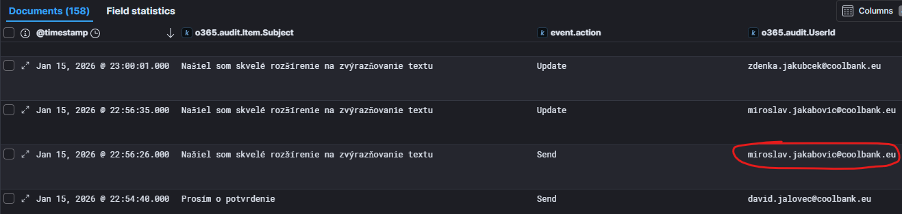
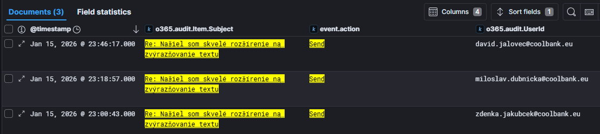
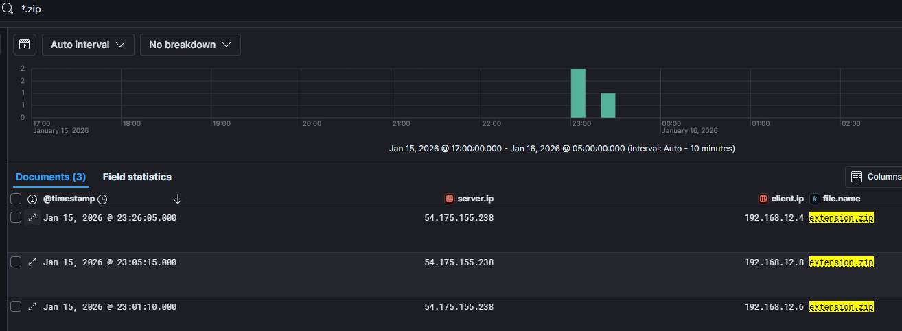
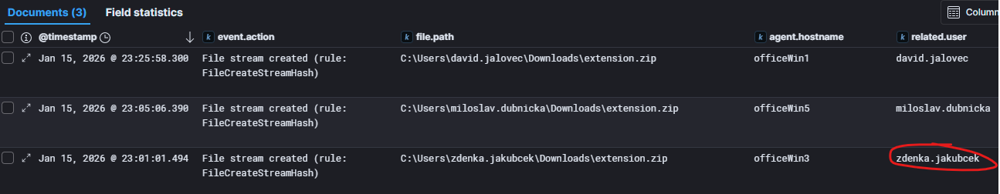
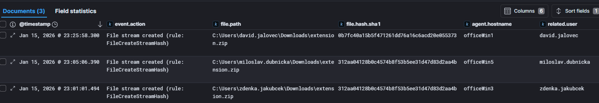
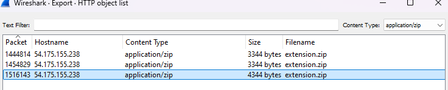
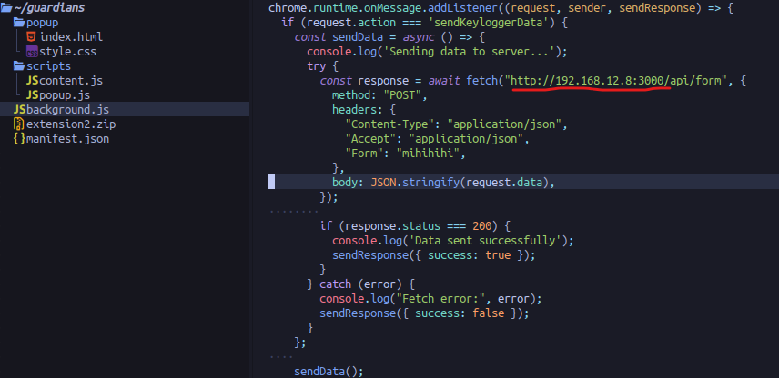
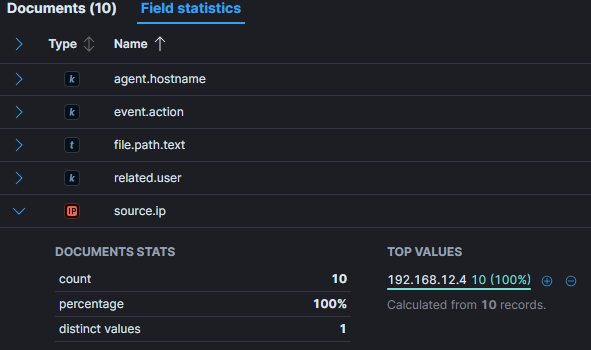

# EXT

## EXT01
> Analysts in your organization noticed another user's suspicious logon from foreign country. After initial analysis you realize that the leak may be much worse than it seems. While analyzing emails you notice conversation about new browser extension that users started installing. What is email of the user who notified colleagues of new extension?

The first step was to show emails in Kibana Discover dashboard, in `o365-*` Data view and show subjects. After looking through them we found emails with `Našiel som skvelé rozšírenie na zvýrazňovanie textu` which sounded suspicious. We also added fields `event.action` and `o365.audit.UserId` to better understand action and who performed it.

> Flag: `miroslav.jakabovic@coolbank.eu`

## EXT02
> You take a closer look at the emails and write down some things you have noticed as they might be important down the road. What is the subject of email chain in which employees discuss this extension?

Visible in previous task.

> Flag: `Našiel som skvelé rozšírenie na zvýrazňovanie textu`

## EXT03
> When was the first email regarding extension sent? 
Use ISO8601 format e.g.: 2026-01-17T22:49:53

Since there were multiple timestamps in the event, we consulted LLM to see if field `o365.audit.CreationTime` was the time when email was sent. Note that `@timestamp` shown in the screenshot is in CET timezone which is UTC+1.

> Flag: `2026-01-15T21:56:26`

## EXT04
> What are the emails of users that replied in conversation with Miroslav Jakabovic about extension?
Sort answers in alphabetical order by name and separate values by comma.

Found the list of users that replied in the thread with filter `"Re: Našiel som skvelé rozšírenie na zvýrazňovanie textu" and event.action:"Send"`:

> Flag: `david.jalovec@coolbank.eu,miloslav.dubnicka@coolbank.eu,zdenka.jakubcek@coolbank.eu`

## EXT05
> Several users visited web mentioned in the email and downloaded the extension. Your thoughts lead you to network traffic and file streams. What is IP of the server that extension was downloaded from?

Browser extensions are usually `.crx` or `.zip` files. Searching for `.crx` returned single result which turned to be dead end, however after searching for `*.zip` in the `All logs` Data view, three documents are found and all downloaded `extension.zip` from `54.175.155.238`:

> Flag: `54.175.155.238`

## EXT06
> What is the file extension of the file that was downloaded from the server?

Visible from previous task.

> Flag: `zip`

## EXT07
> What are IPs of devices that downloaded extension from this server?
Sort IP addresses in ascending order and separate values by comma

Visible from previous task.

> Flag: `192.168.12.4,192.168.12.6,192.168.12.8`

## EXT08
> You have noticed multiple workstations that download the extension. What are the names of the computers that downloaded the extension?
Sort hostnames in alphabetical order and separate values by comma

To find the hostnames for the IPs that downloaded extension, we look at `winlogbeat-*` Data view and search for `host.ip:(192.168.12.4 OR 192.168.12.6 OR 192.168.12.8)` and show `agent.hostname` field. 
Or we can just look at the Environment picture.

> Flag: `officeWin1,officeWin3,officeWin5`

## EXT09
> Which user downloaded extension as first?

In the `winlogbeat-*` search for `host.ip:(192.168.12.4 OR 192.168.12.6 OR 192.168.12.8) and file.name:"extension.zip"` and show the `related.user` field. Answer is the earliest timestamp:

> Flag: `zdenka.jakubcek`

## EXT10
> Which user downloaded extension as second?

Visible from previous task.

> Flag: `miloslav.dubnicka`

## EXT11
> Which user downloaded extension as third?

Visible from previous task.

> Flag: `david.jalovec`

## EXT12
> Closer look at the downloaded files reveals that they are not the same. What is the sha1 hash of the extension file downloaded as first?

From the previous search, just add `file.hash.sha1` to the table.

> Flag: `312aa04128b0c4574b8f53b5ee31d47d83d2aa4b`

## EXT13
> What is the sha1 hash of the different extension file?

Visible from previous task.

> Flag: `0b7fc40a15b5f471261dd76a16c6acd20e055373`

## EXT14
> This is very interesting, two different versions of the same extension downloaded within 30 minutes. Let's check the difference. The second one seems to have some nasty functionality and based on the actual code, wants to communicate with some IP addresses. What is the IP address in the source code of the updated extension?

To obtain the source code of the extension, we need to extract ZIP file from PCAP file provided in the Environment section. We opened pcap file in Wireshark and go to File->Export Objects-> HTTP. One the Wireshark lists all HTTP objects, we select `application/zip` from `Content type` and see three objects. Since we know that two are identical, we'll download third one:

Just to be sure we downloaded the correct zip file, we compared calculated SHA1 to make sure we have correct files. After opening the zip file and investigating the source code, we found IP address mentioned in one of the .js files:

> Flag: `192.168.12.8`

## EXT15
> Internal IP address? This doesn't make sense. What is the hostname of the machine with this IP address?

Filtered `winlogbeat-*` for `host.ip: 192.168.12.8` and looked at `host.hostname` of the log events.

> Flag: `officewin5`

## EXT16
> Which user does this workstation belong to?

In the Field statistics view for `related.user` for the above `host.ip` filter, we looked which users where in the event logs, and almost half messages had this value.

> Flag: `miloslav.dubnicka`

## EXT17
> Which workstation were credentials extracted from?

From the analysis of the source code, we know that extension sending data to `http://192.168.12.8:3000` so, in `winlogbeat-*` we search for `destination.ip:"192.168.12.8" and destination.port:"3000"` and look which `source.ip` was connecting to this destination. Only one `source.ip: 192.168.12.4` which belongs to `officeWin1`.

> Flag: `officeWin1`

## EXT18
> Which windows process was used to install and launch JS runtime environment later utilized during data collection?

> Flag: `cmd.exe`

## EXT19
> Which JS runtime environment did user utilize to launch server and collect data from other workstations?

> Flag: ``

## EXT20
> What is the full directory path where the suspicious extension's data collection file is located?

> Flag: ``

## EXT21
> What is the PID of the process that executed server file for the first time

> Flag: ``

## EXT22
> Which package manager was used to install dependencies

> Flag: ``

## EXT23
> Your colleagues analyzed workstation and discovered file that seems to store stole data. Can you identify whose email password was stolen?
> [keylogger.txt](img/EXT/keylogger.txt)

> Flag: ``

## EXT24
> What is the password for the account?

> Flag: ``

## EXT25
> When was the password submitted? Expected answer is timestamp.

> Flag: ``

## EXT26
> Once you found out origin of the leak you decided to take a closer look at the foreign login. From which foreign IP did attacker log in?

> Flag: ``

## EXT27
> From which country did the login come from?

> Flag: ``

## EXT28
> Which organization owns server that login came from?

> Flag: ``

## EXT29
> What app did attacker use to log into the accout?

> Flag: ``

## EXT30
> What user agent was used by attacker during logon?

> Flag: ``

## EXT31
> As you slowly uncover plot of the attack you take a look at activities of the attacker. How many unique rules were created by the attacker?

> Flag: ``

## EXT32
> When was the forward rule created? Use ISO8601 format e.g.: `2026-01-17T22:49:53`.

> Flag: ``

## EXT33
> What email account were the incoming emails forwarded to?

> Flag: ``

## EXT34
> What keyword is required in subject to execute second rule?

> Flag: ``

## EXT35
> To which folder is email moved to when rule is executed?

> Flag: ``

## EXT36
> When was the email that was moved to archive accessed by the attacker? Use ISO8601 format e.g.: `2026-01-17T22:49:53`.

> Flag: ``

## EXT37
> What subject did the attacker use to bypass this rule and send fake email with similar subject?

> Flag: ``