# HR

## HR01
> Shortly after 21:00 CET, several alerts about risky sign-in were generated in the company SIEM. What is the username involved in these alerts? Format: user.name@domain.tld

We begin by opening Kibana interface and navigate to Security->Alerts dashboard, where we look at alerts generated around 21:00 and notice two of them where user `lea.ciger@coolbank.eu` was mentioned.

> Flag: `lea.ciger@coolbank.eu`

## HR02
> Let's focus on the alert with name "Entra ID Protection - Risk Detection - Sign-in Risk". What is the severity of the alert?

From previous task we can see that severity of the alert is `high`.

> Flag: `high`

## HR03
> What is the IP address from which Lea Ciger logged in?

Also from task [HR01](#hr01) from the alert details we see `event with source 36.50.238.15`.

> Flag: `36.50.238.15`

## HR04
> What is the name of the country Lea logged in from? (There are different countries in different databases, check also based on ASN info)

Checking the IP against [AbuseIPDB](https://www.abuseipdb.com/check/36.50.238.15), we see it is `Singapore`.

> Flag: `Singapore`

## HR05
> What is the ASN organization name? Format: Two words

From the IPinfo search of the IP address, we see the ASN organization is `Datacamp Limited`.

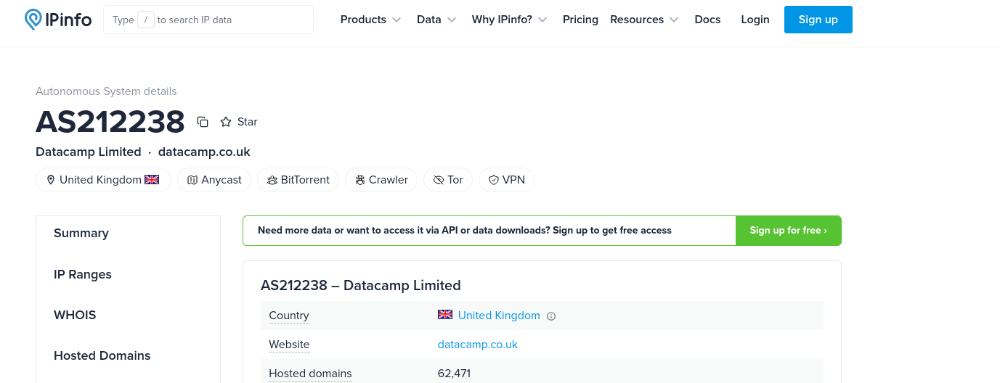

> Flag: `Datacamp Limited`

## HR06
> Now check the exact reason why the detection rule fired. What is the risk type detected?

From the alert details in Kibana, we see the risk type is `anonymizedIPAddress`.
!{}(img/HR/HR06.png)

> Flag: `anonymizedIPAddress`

## HR07
> What is the display name of the application Lea logged in to?

Viewing logs with user.name lea.ciger@coolbank.eu and events that have `azure.signinlogs.properties.app_display_name: *` in them, I found the relevant log showing the application display name as `One Outlook Web`.

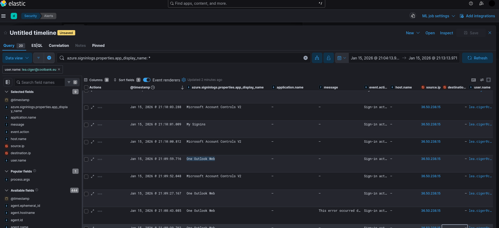

> Flag: `One Outlook Web`

## HR08
> Quick recap - Lea logged in to Outlook Web from IP address located in Bangladesh, owned by VPN provider. Could be really suspicious or just forgotten VPN. Let's find out more. Quickest way to find out would be to call her. Unfortunately, she is not picking up her phone. We need to find out ourselves. What is the user_agent.name used for this login?

Looking at the same log as in HR07, we can see the user agent name is `Chrome`.

> Flag: `Chrome`

## HR09
> What is the user_agent.name in Lea's other historical logs?

Looking at other historical logs for Lea Ciger, we can see the user agent name is `Edge`.

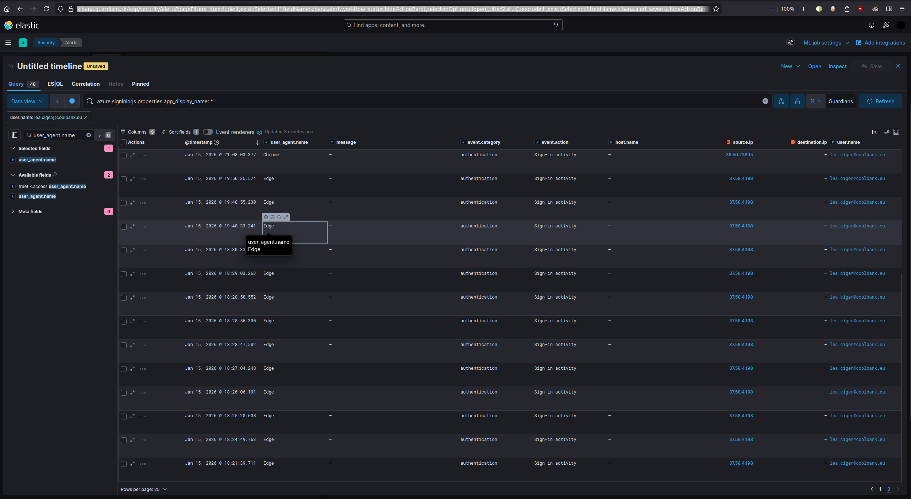

> Flag: `Edge`

## HR10
> Hmm, first inconsistency. But it still could be benign. Based on the user's historical login patterns, which IP address represents Lea’s primary home/office location?

From the same query as in HR09, we can see the primary home/office location IP address is `37.58.4.198`

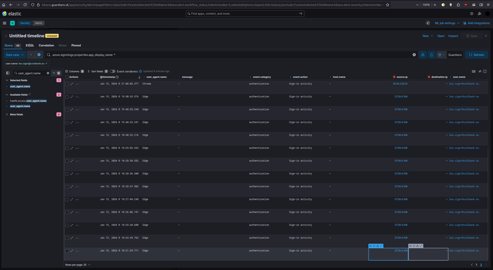

> Flag: `37.58.4.198`

## HR11
> What was the authentication requirement of the login from Bangladesh?

Viewing the log for the login from Bangladesh, we can see the authentication requirement is `singleFactorAuthentication`.

> Flag: `singleFactorAuthentication`

## HR12
> What was the authentication method of the login from Bangladesh?

Looking at the same log, we can see the authentication method in the field `azure.signinlogs.properties.authentication_details` is `Password`.

> Flag: `Password`

## HR13
> What was the authentication step result?

Again same log and the field `azure.signinlogs.properties.authentication_step_result` shows authentication_step_result_detail as  `Correct password`.

> Flag: `Correct password`

## HR14
> After correct password, authentication sequence is (usually) interrupted and user is presented with "Stay signed in?" prompt. How is this process or feature called by Microsoft?

Searched for the name of the feature in Microsoft documentation and found it is called `Keep Me Signed In`.

> Flag: `Keep Me Signed In`

## HR15
> You can see in the logs if the user was presented the Keep me signed in prompt thanks to one specific error/status code. What code is it?

Viewing details of the log again, we can see the status code is `50140`.

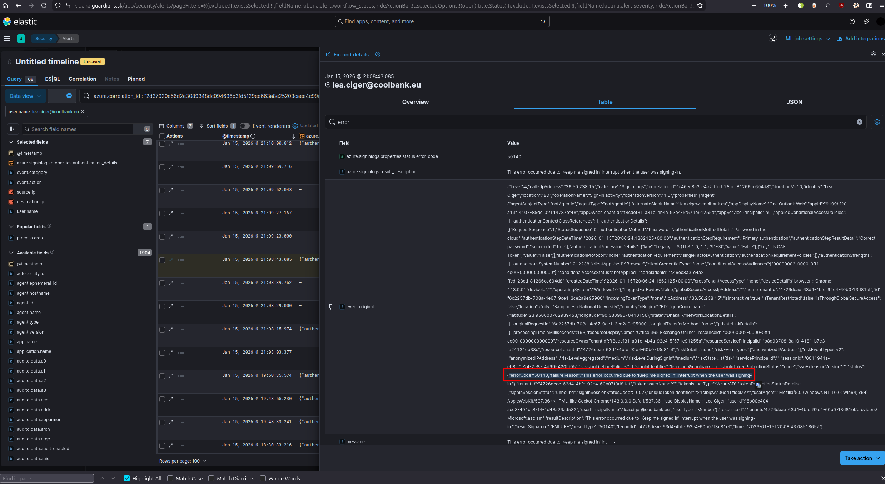

> Flag: `50140`

## HR16
> If the user clicks No, transient cookie is created. What is the name of the cookie?

Searched for the cookie name.

> Flag: `ESTSAUTH`

## HR17
> If the user closes the browser, the ESTSAUTH cookie is destroyed, requiring a fresh login next time. By default, an ESTSAUTH cookie has a validity of up to how many hours?

Again from the Google search.

> Flag: `24`

## HR18
> If the user decides to clicks Yes, persistent cookie is created. What is the name of the cookie?

Again from the Google search.

> Flag: `ESTSAUTHPERSISTENT`

## HR19
> Keep this info in mind, you will need it bit later. Let's get back to the incident. After login, Lea or attacker checked Outlook web and read some emails. Based on emails available in the Inbox folder, who was trying to reach Lea in Microsoft Teams?

By correlating logs with client.address belonging to 37.50.238.15 and looking at the emails in the inbox, we can see that Zdenka Jakubcek was trying to reach Lea in Microsoft Teams.

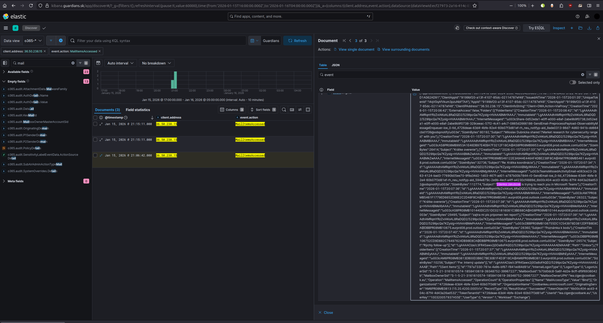

> Flag: `Zdenka Jakubcek`

## HR20
> What is the Internet Message ID of the email with subject "Doplnenie k dohode"? Format: without <> brackets.

Log message for the email with mentioned subject and we look at InternetMessageId field in the event.original, we find the ID.
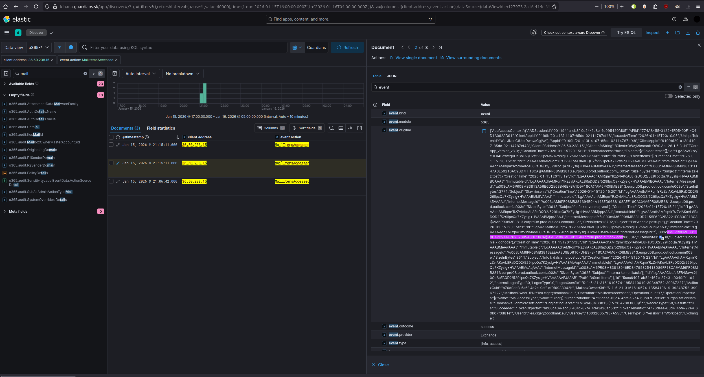

> Flag: `AM6PR08MB38130D42D944F762F2085A83F18CA@AM6PR08MB3813.eurprd08.prod.outlook.com`

## HR21
> You probably noticed that you need to jump between o365 and azure logs if you want to see the complete picture what happened. Some event are shown different in both of them, some are even missing. It is also the case here. There was an attempt to access other web application few minutes later, but was not successful. What is the error / status code of this attempt?

Filtering for same client.address and event.action USerLoginFailed, we can see the error code is `50072`.
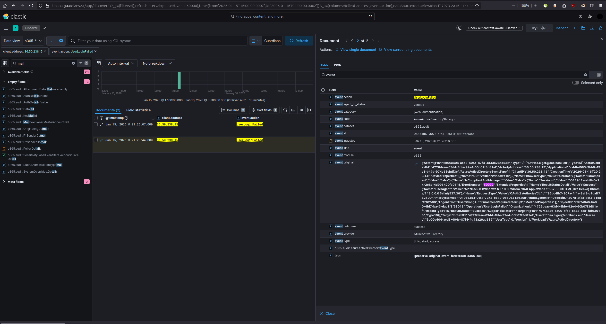

> Flag: `50072`

## HR22
> Based on Microsoft error codes reference, what is the logon error name (or description)? Format: VeryLongWordAlmostGermanStyle

Same log message as in HR21, see highlighted error code below. 

> Flag: `UserStrongAuthEnrollmentRequiredInterrupt`

## HR23
> As you probably read yourself, it means that user needs to enroll for second factor authentication to access this application. Seems that our user was lazy to do this, as logs don't show any successful login. What was the web application with request to enroll 2fa?

Searching for the application id in the log message, and then correlating it with the documentation of Microsoft applications, we find out that the application is `Azure Portal`.

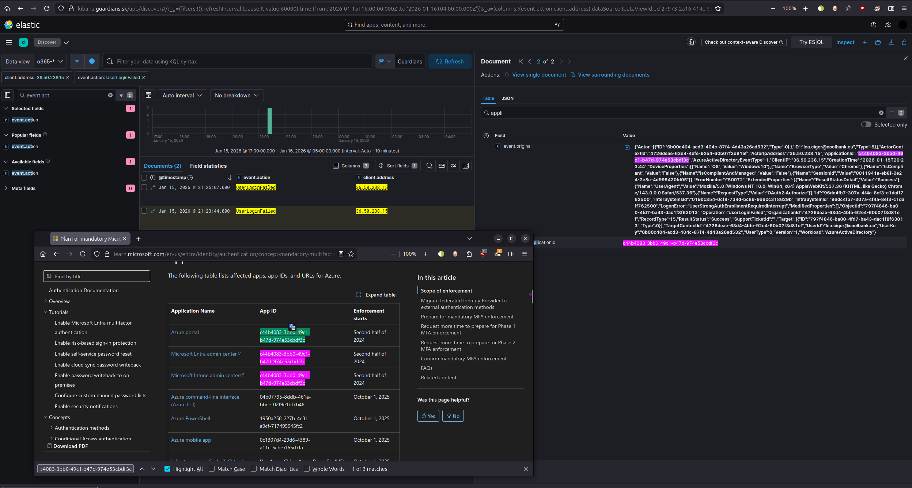

> Flag: `Azure Portal`

## HR24
> If except o365 and azure logs you also are looking to SIEM alerts section, you could notice several alerts for events related to Lea Ciger. Consent was granted to third party application to access Lea's account. What is the name of the application?

Filtering for event action Consent To Application and viewing the log.

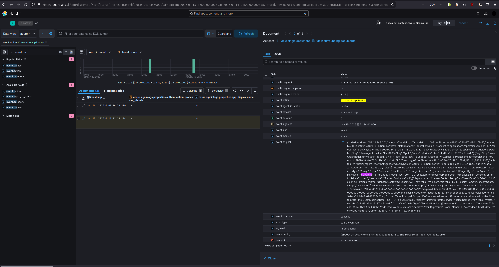

> Flag: `eM client`

## HR25
> What is the full name of the OS on which eM Client is running?

Filtering for eM client related logs and viewing the os.full field. See screenshot below.

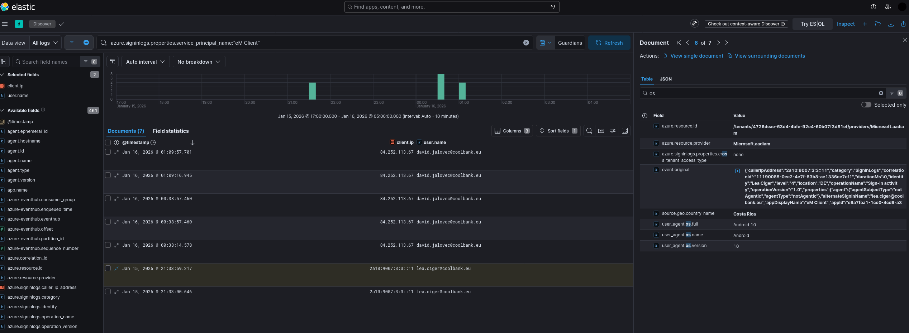

> Flag: `Android 10`

## HR26
> What is the first country from which eM Client connected to Lea's account?

Same log message as in HR25, see geoip.country_name field.

> Flag: `Costa Rica`

## HR27
> There was also some other activity, accessing Lea's emails from other countries, apparently through VPN. How did attacker get Lea's password to O365? Admin together with Lea reviewed mail trace logs for signs of phishing email, browser history too, but they haven't found anything. Lea's computer and inbox were clean. They reached to Binary Confidence for help and soon found out. And you can see yourself too :)

> Binary Confidence is proud partner of Hudson rock with access to the Industry's Most Robust Compromised Credentials Data Source - Cavalier. Just visit their webpage and find out yourself.

> How many compromised Coolbank employees did you find?

Searching for coolbank.eu domain on https://www.hudsonrock[.]com/search/domain/coolbank.eu we found 1.

> Flag: `1`

## HR28
> There is some more info available using Hudson rock free tools, but we will show you what is inside. Check the attached archive with screenshots from the paid platform and original stealer log. What is the name of the stealer log with Lea's credentials?
> [1._domain_search.jpeg](img/HR/01._domain_search.jpeg) [02._stealer.jpeg](img/HR/02._stealer.jpeg) [03._AI_analyzer.jpeg](img/HR/03._AI_analyzer.jpeg) [hudsonrock.zip](img/HR/hudsonrock.zip)

From 02._stealer.jpeg we can see the name of the log file is `SK_@FATETRAFFIC_2026_01_12_123456-20260112T151050Z-3-001`.

> Flag: `[SK]_@FATETRAFFIC_2026_01_12_123456-20260112T151050Z-3-001`

## HR29
> What was the Date and Time of the initial infection according to the log metadata? Format: `YYYY-MM-DD HH:mm`.

From previous message the image 01._domain_search.jpeg we can see the date and time of the initial infection is `2026-01-12 01:03`.

> Flag: `2026-01-12 01:03`

## HR30
> What is the exact path from which the malware was executed on the victim's PC?

From 01._domain_search.jpeg. 

> Flag: `C:\Users\leuska\AppData\Local\Temp\11808150101\bDjqu09.exe`

## HR31
> Which Stealer Family generated this log?

From images from HR28.

> Flag: `Vidar`

## HR32
> The stealer captured Lea’s IP address at the time of infection. What was it?

From images from HR28.

> Flag: `85.216.129.231`

## HR33
> What Antivirus software was installed on the infected computer?

From images from HR28.

> Flag: `Windows Defender`

## HR34
> According to the stealer log, what is the Computer Name of Lea Ciger’s infected machine?

From images from HR28.

> Flag: `G2026`

## HR35
> What was the install date of the machine?

From the zip file and the file `information.txt` inside.

> Flag: `28/11/2025 18:34:35`

## HR36
> How many unique passwords are in the stealer log?

Counting the unique unique passwords.

> Flag: `17`

## HR37
> What is the value of the stolen cookie which could be used by attacker to access Lea's O365 account even without password or with 2fa enabled?

From file Google Chrome_Profile 1.txt viewing ESTSAUTHPERSISTENT.

> Flag: `1.AU8Art4mR9Rj_kuS5GCwfz2B7yC_mZE_oQdBhdwCEUeH70gBAABPAA.AgABFwQAAACvnsHKEvvRQb3Bz3Qc7wnaAwDs_wUA9P8tltUhRSHy8kFkX118C264PtkHlHgMN2FTa5YdU7jnk9mWobZY-SqthVIm3QaytOL2ffkwxcp3Sp_my_68I9pskMXStbpK4P3IF5iVND1oOnkcllhxper4Jm5a0hwGGNiRpc7EZ82lt17DD8HUYEzoVapMoDUuLL62AaHZwNwK1EG7gpntodhl6AKGnKDyy7sSMMK95JrA9xslK2UyfNZ8g9VWIh6dbChxzjiqjxvywmP2RN2DOuopTdXuUIEnKircPhpISqLyNV1BACT9wNE8Zn_s5ygvj95LAFcxL76ySvWd-wd6fc3rG2c3pXlWm3SFEhfFiTkm5GvuyCKWiytRxHpeq89MlQIM8XW44kiJLw3bnbvJGxuj0Rxncaf8pv3nLGsgRc8ycSqm47nwPlLaHkGhQJyZQgQJBkeS2NjkHRCf12VWtGRVH4FiyPXRcGxvToqAAURXSDtX0BbtOfwTEPCMv5PPaEV2VZEBnZwV03jaXmxUt6HR1myZXUVImYFMHY-Mh-iQicWjuoNYhChRLZ7czmQ_e9yWosxZbh9NZzD5gYgoPKjIknhclRnlwa02kGrC58BqvvEQs2mMvdXCTIRw7qm01g`

## HR38
> This is the last question of this category. What phone number is visible on the last entry in the leaked browser history?

File Google Chrome_Profile 2.txt has google maps link at the end, which shows Slovenska sporitelna on the map with contact number.

> Flag: `0850111888`
