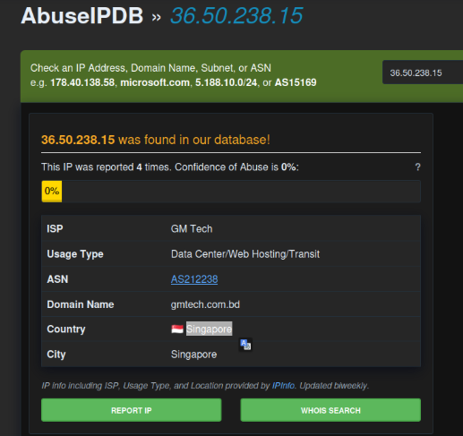

# HR

## HR01
> Shortly after 21:00 CET, several alerts about risky sign-in were generated in the company SIEM. What is the username involved in these alerts? Format: user.name@domain.tld

We begin by opening Kibana interface and navigate to Security->Alerts dashboard, where we look at alerts generated around 21:00 and notice two of them where user `lea.ciger@coolbank.eu` was mentioned.

> Flag: `lea.ciger@coolbank.eu`

## HR02
> Let's focus on the alert with name "Entra ID Protection - Risk Detection - Sign-in Risk". What is the severity of the alert?

From previous task we can see that severity of the alert is `high`.

> Flag: `high`

## HR03
> What is the IP address from which Lea Ciger logged in?

Also from task [HR01](#hr01) from the alert details we see `event with source 36.50.238.15`.

> Flag: `36.50.238.15`

## HR04
> What is the name of the country Lea logged in from? (There are different countries in different databases, check also based on ASN info)

Checking the IP against [AbuseIPDB](https://www.abuseipdb.com/check/36.50.238.15), we see it is `Singapore`.

> Flag: `Singapore`

## HR05
>

## HR06
>

## HR07
>

## HR08
>

## HR09
>

## HR10
>

## HR11
>

## HR12
>

## HR13
>

## HR14
>

## HR15
>

## HR16
>

## HR17
>

