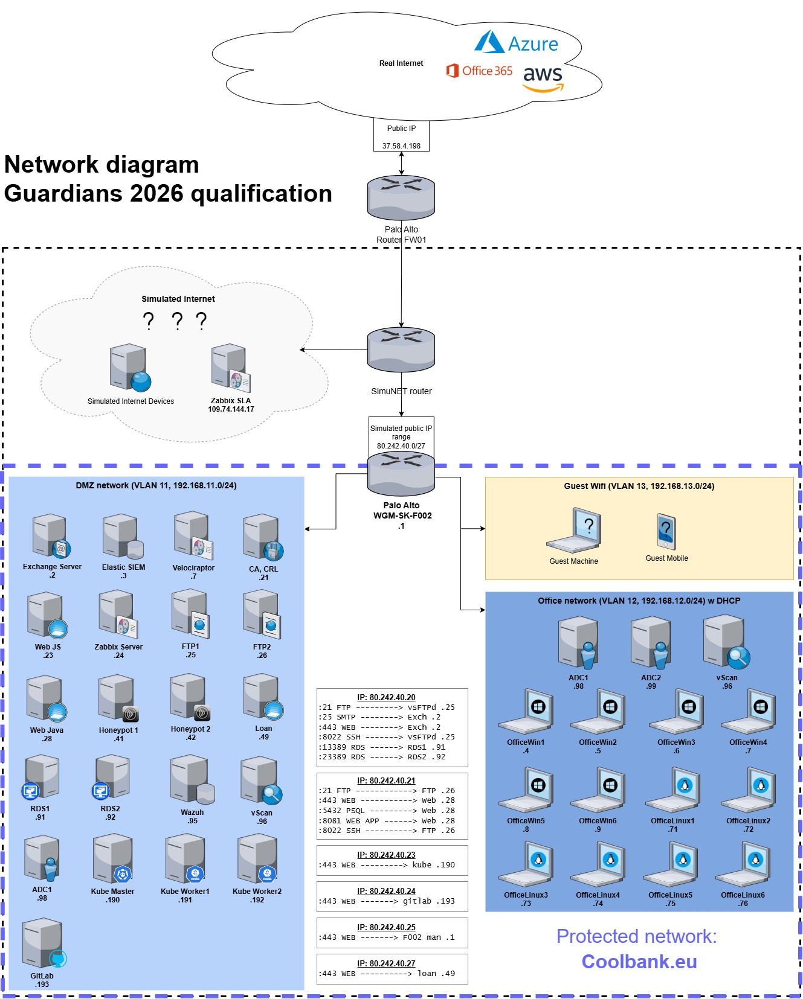

# Guardians 2026 Qualification Write-up

## Introduction

This repository contains write-up for the [Guardians 2026 Qualification](https://www.guardians.sk/guardians2026/) round held online from January 19th to February 1th.

Guardians competition, organized by [Binary Confidence](https://www.binaryconfidence.com/) is Capture the Flag (CTF) style competition focused on Digital Forensics, Incident Response and Threat hunting, where teams try to trace back steps attacker took to compromise the environment, explain how, when, who and what. 

There are several challenge scenarios, each one having multiple questions that teams need to find the answer by uncovering evidence from security logs gathered by the simulated typical business environment and stored in the Elastic SIEM/Kibana.

## Environment

**About company**

Our company is a simulated financial institution called Coolbank, known for very affordable loans, mortgages and other financial services. As other banks, it is in the viewfinder of many malicious actors due to its strategic importance for security of the state. Coolbank just recently started to use Office365 instead of on-prem Exchange. You will still find logs from Exchange, as it hasn't beed fully decomissioned yet. They also plan to sync their Active directory with Azure / Entra ID, but as it needs quite some work, you will find usage of internal domain KYBERAKADEMIA or external COOLBANK.

**Network diagram**

**Tools available**

The perimeter firewall is a Palo Alto PA-440 in detection mode, meaning it detects and logs suspicious activity but does not automatically block it. Firewall logs are sent to Elastic SIEM. Its external IP addresses and public services on them are documented on the network diagram above.

Windows servers and workstations are configured with extended logging policies and have Sysmon installed. Selected event logs are sent to the Elastic SIEM via the winlogbeat agent. Packetbeat is installed on domain controllers to collect DNS requests. Filebeat is installed on the MS Exchange 2016 server to collect text Exchange logs.

Linux servers and workstations have filebeat and auditbeat agents installed. The filebeat agent reads selected logs from servers (Nginx logs, WordPress logs, etc.), and auditbeat collects audit information from the system. These are then sent to Elastic SIEM.

There is also Velociraptor agent installed on all servers and workstations. It is used to remotely collect evidence and investigate incidents. You will however not have access to Velociraptor server during qualification, only to its logs.

Logs from cloud services like AWS, Azure and Office365 are collected by Elastic agent and sent to Elastic SIEM. Be aware about different public IP address of coolbank.eu / kyberakademia.sk visible in real cloud services versus public IP address towards simulated internet. You can find all the IP addresses on the network diagram above.

Logs are processed by Elastic SIEM and if they match some preconfigured detection rule, Alert is generated.

There is also Arkime server doing packet capture of "some" interfaces. You can download the pcap HERE.

## Challenges

* [HR](HR.md) - First scenario. 

* [AWS](AWS.md) - TBD.

* [Ext](Ext.md) - TBD.

* [Loan](Loan.md) - TBD.

* [DC](DC.md) - TBD.

* [DMZ](DMZ.md) - TBD.

## Top 10 teams
Chart of quickest top 10 teams that gained most points.

